# 通道模板管理

通道模板（Channel Template）是一种**可复用的配置快照**，用于保存通道的点位表（Points）和映射表（Mappings）配置。通过模板，您可以：

- **快速配置新通道**：将已有模板应用到新通道，无需逐项手动配置
- **统一设备配置**：多个相同类型的通道使用同一模板，保证配置一致性
- **备份与迁移**：将通道配置保存为模板，便于备份或在不同项目间复用

每个通道模板包含以下信息：

* ```Name```: 模板的显示名称
* ```Description```: 模板的详细说明（可选）
* ```Protocol```: 支持的通信协议，如 modbus_tcp、modbus_rtu、di_do 等
* ```points_snapshot```: 遥测、信号、控制、调节四类点位的定义
* ```mappings_snapshot```: 点位与协议参数的映射关系

## 模板查看与筛选

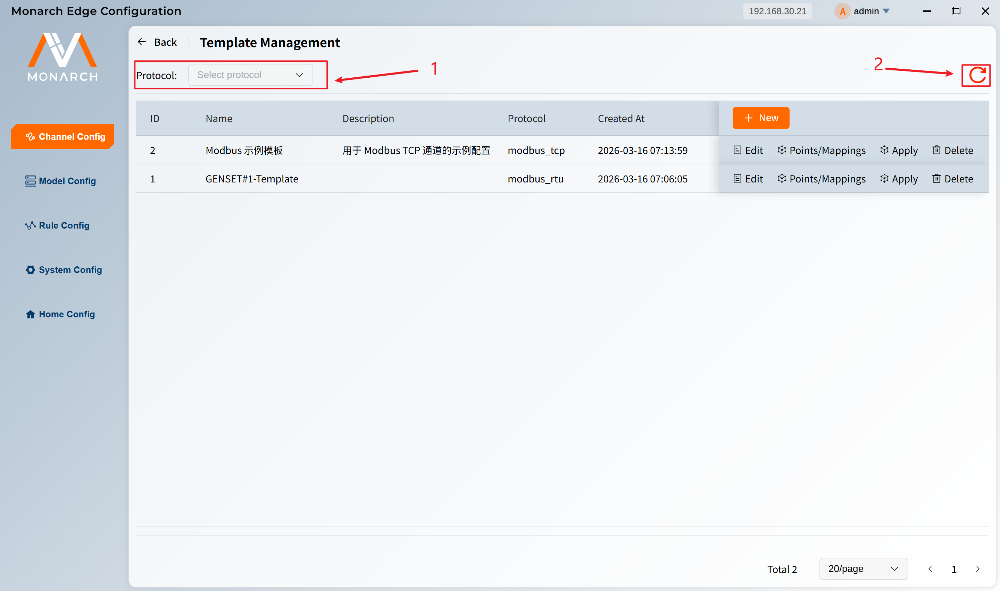

1. 在模板管理页面的工具栏中，可通过条件筛选下拉框筛选模板：
- ```Protocol```：协议类型。选择特定协议（如 modbus_tcp）只显示该协议的模板
2. 刷新图标，点击后重新加载模板列表。

## 访问通道模板

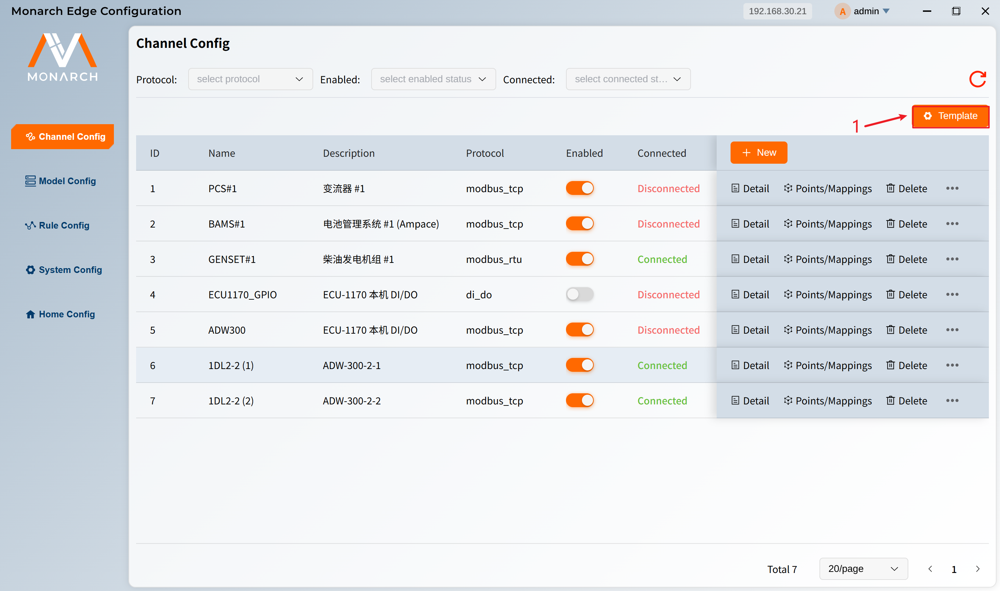

1. 在通道配置页面的工具栏中，点击 **Template** 按钮。


2. 进入 **Template Management**（模板管理）页面。


## 创建通道模板

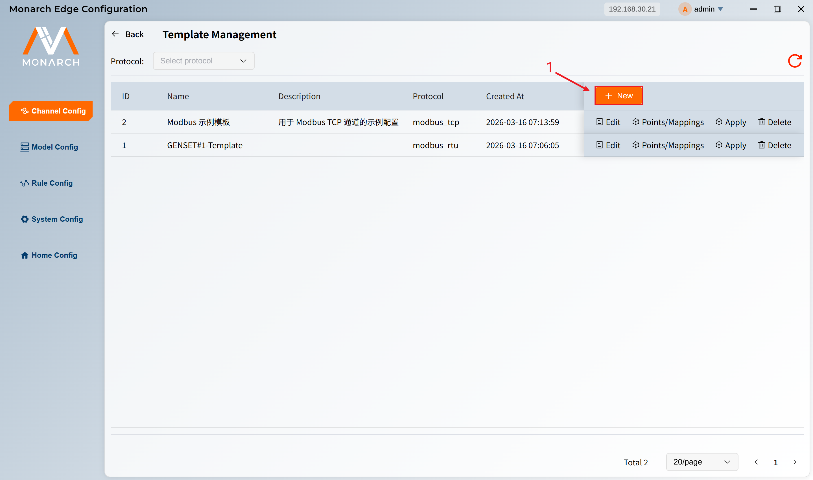

1. 在模板管理页面，点击表格右上角的 **New** 按钮，打开「添加模板」弹窗。

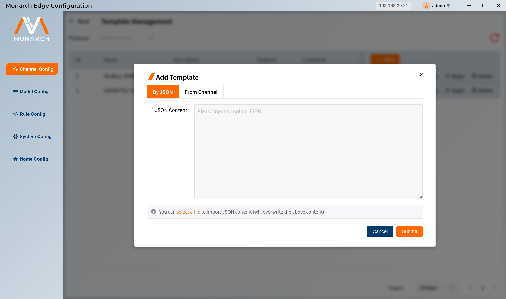

创建通道有两种形式：**通过JSON创建** 和 **从现有通道创建**。

### 方式一：通过 JSON 创建

适用于**批量导入**或**已有 JSON 模板文件**的场景。

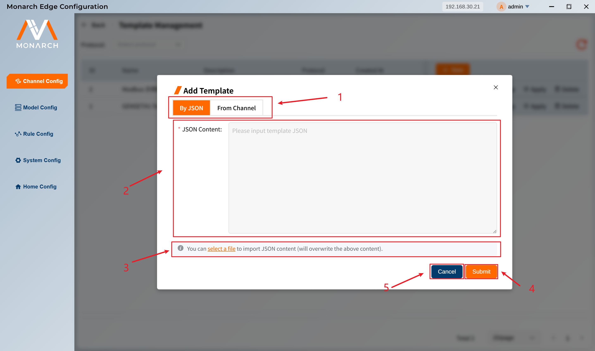

1. 在弹窗中切换到 **By JSON** 标签页。
2. 在 **JSON Content** 文本框区域直接编写/粘贴 JSON 内容：JSON 格式要求：

```json
{
  "name": "Modbus 示例模板",
  "description": "用于 Modbus TCP 通道的示例配置",
  "protocol": "modbus_tcp",
  "points_snapshot": {
    "telemetry": [
      {
        "point_id": 1,
        "signal_name": "温度",
        "data_type": "float32",
        "scale": 1,
        "offset": 0,
        "unit": "℃"
      }
    ],
    "signal": [],
    "control": [],
    "adjustment": []
  },
  "mappings_snapshot": {
    "telemetry": [
      {
        "point_id": 1,
        "signal_name": "温度",
        "protocol_data": {
          "slave_id": 1,
          "function_code": 3,
          "register_address": 0,
          "data_type": "float32",
          "byte_order": "AB"
        }
      }
    ],
    "signal": [],
    "control": [],
    "adjustment": []
  }
}
```

3. 可以点击 **select a file** 按钮，选择一个具有同样JSON格式要求的JSON文件，其内容会展示到 **JSON Content** 文本区域。
4. 点击 **Submit** 按钮提交。
5. 点击 **Cancel** 按钮取消。

> **注意**：JSON 格式必须正确，否则会提示「JSON format is invalid」。

### 方式二：从现有通道创建

适用于**将已配置好的通道保存为模板**的场景。

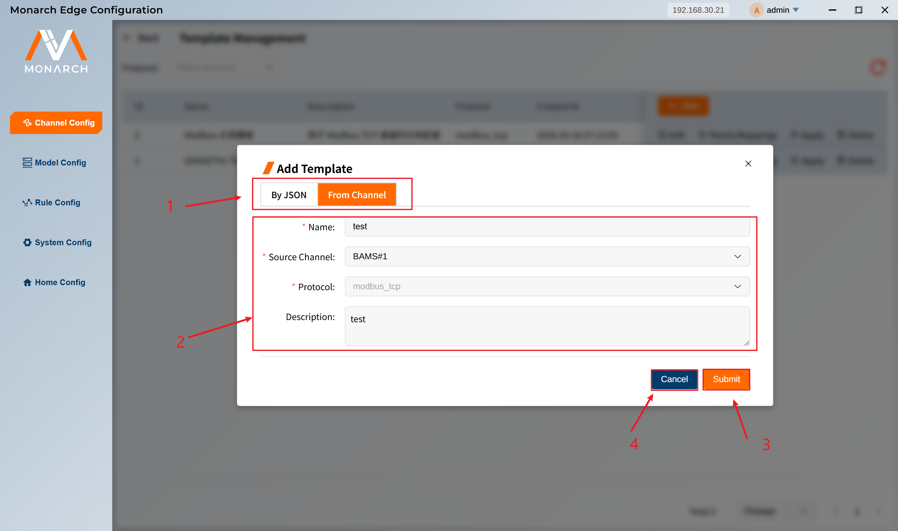

1. 在弹窗中切换到 **From Channel** 标签页。
2. 填写表单：
   - ```Name```：模板名称（必填）
   - ```Source Channel```：选择要作为来源的通道（必填）
   - ```Protocol```：自动根据所选通道填充，不可修改
   - ```Description```：模板描述（可选）
3. 点击 **Submit** 按钮提交。
4. 点击 **Cancel** 按钮取消。
系统会将该通道的**点位快照**和**映射快照**保存为模板。

> 用户还可以从通道配置页实现模板的快速创建。在通道配置页面，每条通道的操作列中有一个 **更多** 下拉菜单（⋮）：
>
>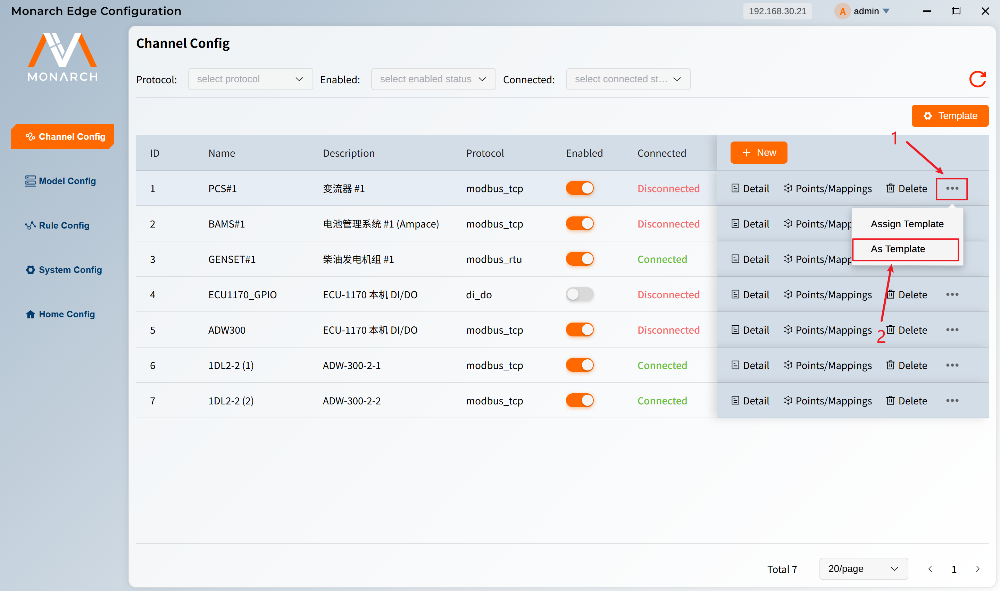
>
>1. 点击某条通道的 **更多** 图标按钮，打开 **更多** 下拉菜单。
>2. 点击 **As Template** 按钮，弹出操作面板。
>
>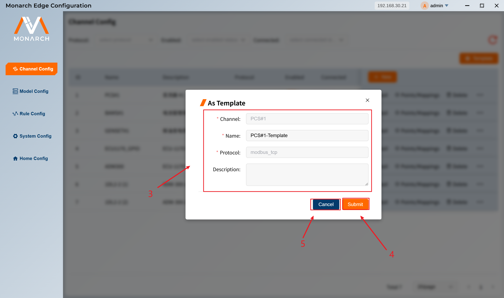
>
>3. 在弹出的「As Template」对话框中：
>   - 通道名称和协议自动填充
>   - 填写模板名称（默认：`通道名-Template`）
>   - 填写描述（可选）
>4. 点击 **Submit** 按钮提交。
>5. 点击 **Cancel** 按钮取消。

## 应用模板到通道

### 方式一：在模板管理页应用


 
1. 在模板列表中，找到要应用的模板，点击该行的 **Apply** 操作。

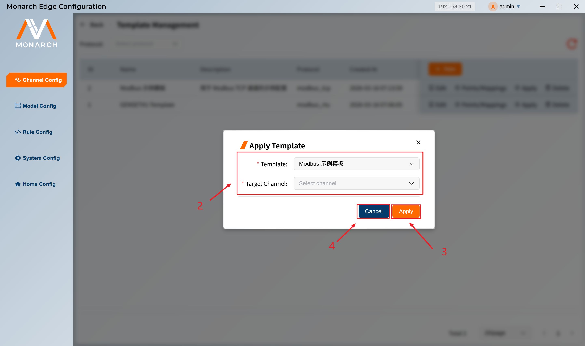

2. 在「Apply Template」对话框中：
   - ```Template```：选择要应用的模板（可预选）
   - ```Target Channel```：选择目标通道
3. 点击 **Apply** 按钮执行。
4. 点击 **Cancel** 按钮取消。
> **提示**：目标通道列表会根据所选模板的协议自动过滤，只显示协议类型匹配的通道。

### 方式二：在通道配置页应用

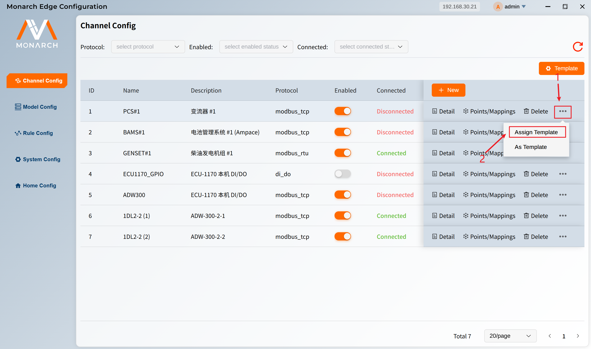

1. 点击某条通道的 **更多** 图标按钮，打开 **更多** 下拉菜单。
2.  点击 **Assign Template** 按钮，弹出操作面板。

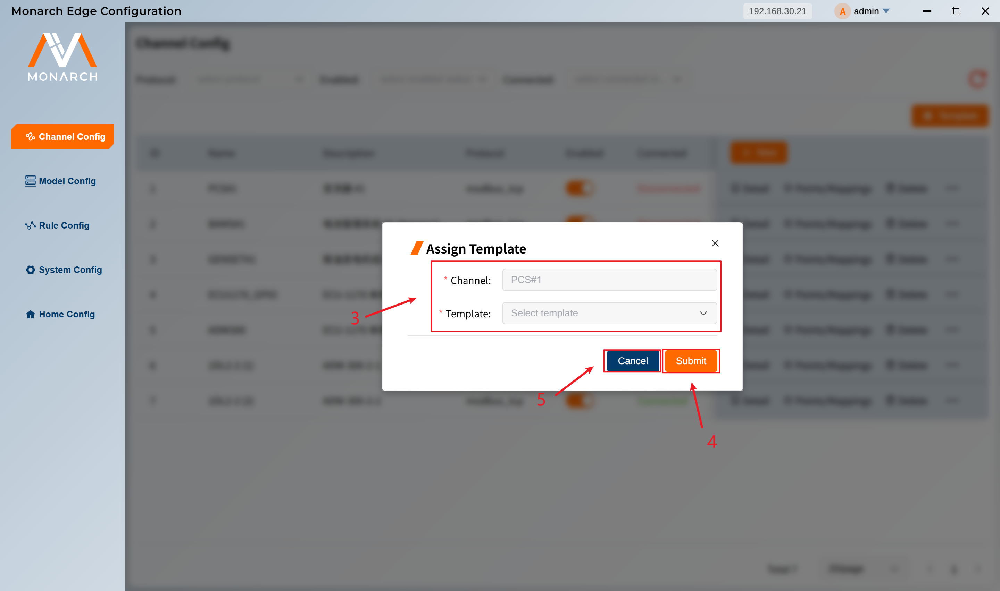

3. 在「Assign Template」对话框中：
   - ```Channel```：通道名称自动显示
   - ```Template```：选择要应用的模板（仅显示协议类型匹配的模板）
4. 点击 **Submit** 按钮提交。
5. 点击 **Cancel** 按钮取消。

>**应用行为说明**
>
>**覆盖模式**：应用模板时，默认会**清除目标通道的现有点位和映射**，再导入模板内容
>**适用场景**：适用于新通道初始化或需要完全重置通道配置的场景

## 编辑模板


1. 在模板管理页面的表格中，点击某条模板的 **Edit** 操作。

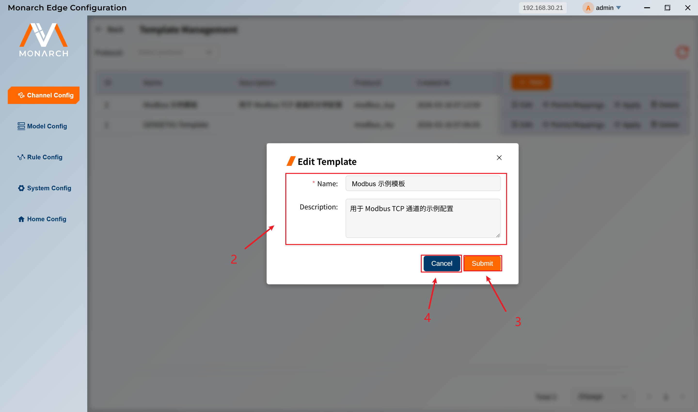

2. 在「Assign Template」对话框中,可编辑字段有：

  - ```Name```：模板名称（必填）
  - ```Description```：模板描述（可选）

3. 点击 **Submit** 按钮提交。
4. 点击 **Cancel** 按钮取消。
> **注意**：点位和映射内容**不可编辑**。如需修改，请删除旧模板后重新创建，或从修改后的通道重新生成模板。

## 查看模板详情

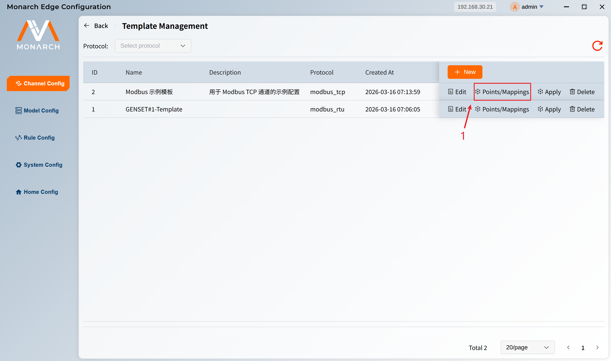

1. 在模板管理页面，点击某条模板的 **Points/Mappings** 操作，进入模板详情页。

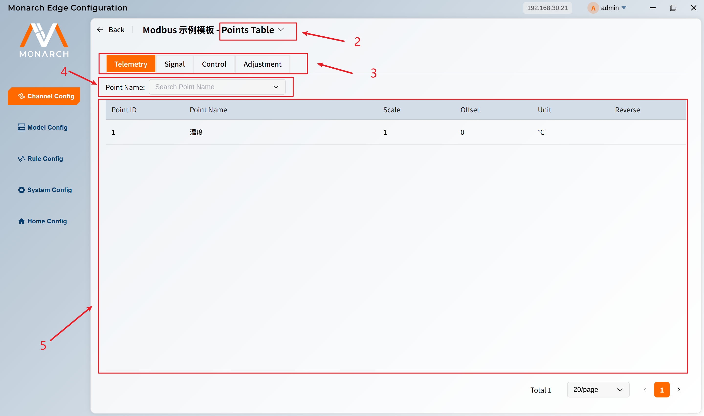

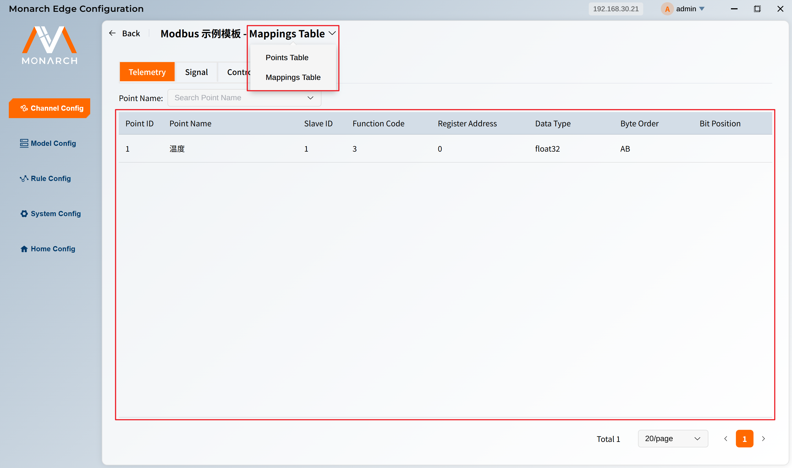

2. **视图切换** 按钮，点击后会弹出下拉菜单，可选择 **Point Table** 和 **Mapping Table**，分别展示模板点位以及点位对于的路由。默认展示 **Point Table** 视图。
3. **点位类型切换** 按钮，分别有**Telemetry**、**Signal**、**Control**、**Adjustment** 四类点位，对应通道点位的四遥分类。点击展示对应类型下的点位。
4. 点位筛选框，可以手动输入进行点位名称的模糊搜索或者通过下拉框对点位名称的选择进行精准搜索。
5. 点位/点位映射数据表格，具体字段解释参考 [通道点位](/cn/manuals/basic-knowledge/system-concepts-channel/channel-points.html) 和 [通道点位映射](/cn/manuals/basic-knowledge/system-concepts-channel/channel-mappings.html)。

> **注意**：di_do 协议不包含 Telemetry 和 Adjustment 标签。

## 删除模板

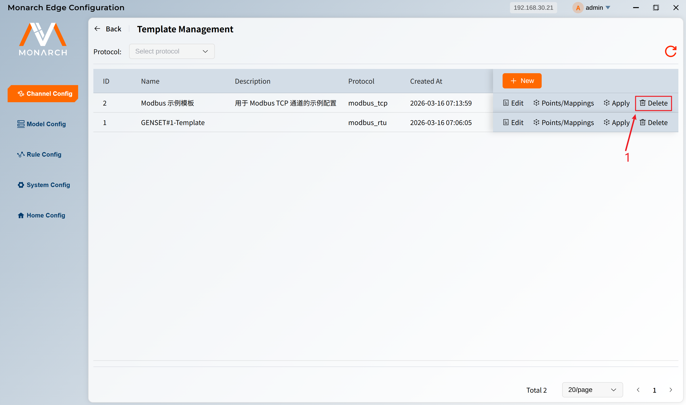

1. 在模板管理页面的表格中，点击某条模板的 **Delete** 操作。

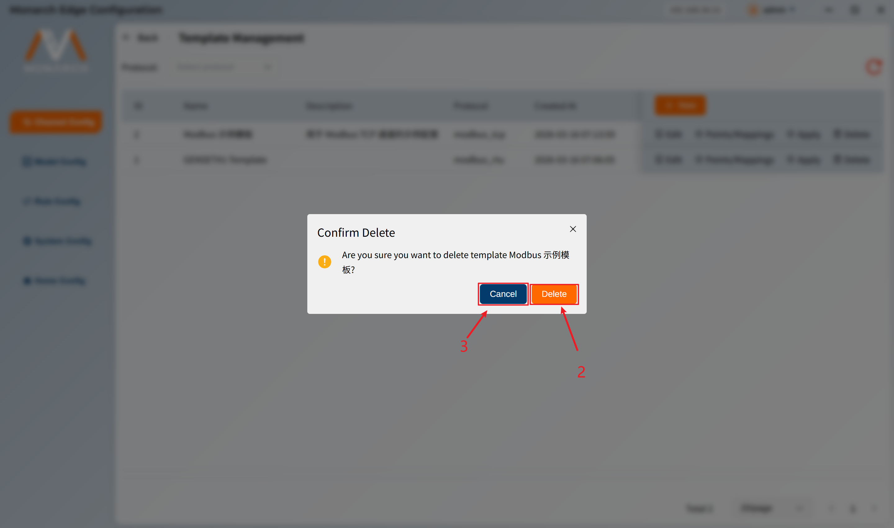

2. 点击 **Delete** 按钮确认删除。
3. 点击 **Cancel** 按钮取消删除。


<!-- ## 九、常见问题

### Q1：为什么应用模板时提示「Template protocol must match channel protocol」？

**答**：模板与通道的协议类型必须一致。例如，modbus_tcp 模板只能应用到 modbus_tcp 通道。请检查目标通道的协议类型。

### Q2：应用模板后，通道原有的点位会怎样？

**答**：默认会**清除**目标通道的现有点位和映射，再导入模板内容。如需保留原有数据，请勿使用该功能。

### Q3：模板中的点位数量如何查看？

**答**：在模板列表中，每条模板会显示 `point_counts` 等信息。

### Q4：能否修改模板中的点位和映射？

**答**：当前版本不支持直接编辑模板的点位和映射。建议：
- 将模板应用到目标通道
- 在通道的点位/映射表中修改
- 再将修改后的通道保存为新模板

### Q5：JSON 模板格式从哪里获取？

**答**：可从以下方式获取：
- 从已导出的模板文件
- 从其他项目的模板导出
- 参考本文档的 JSON 格式示例自行编写 -->
