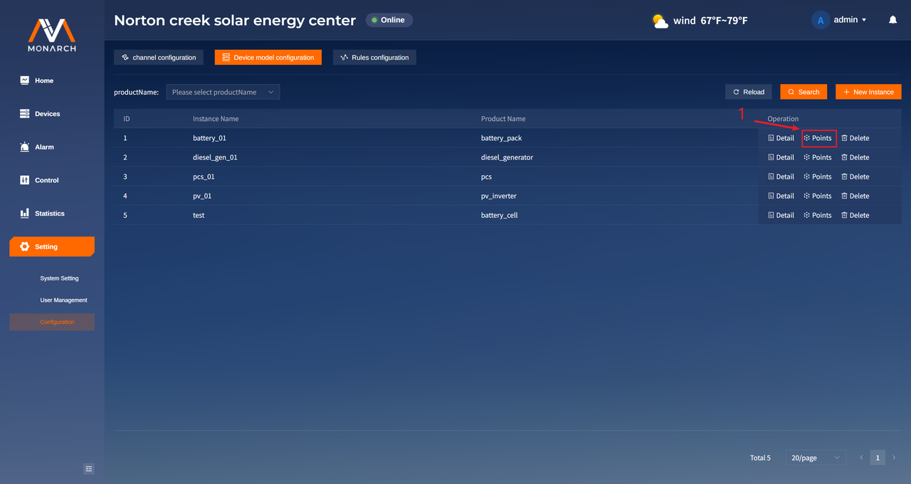
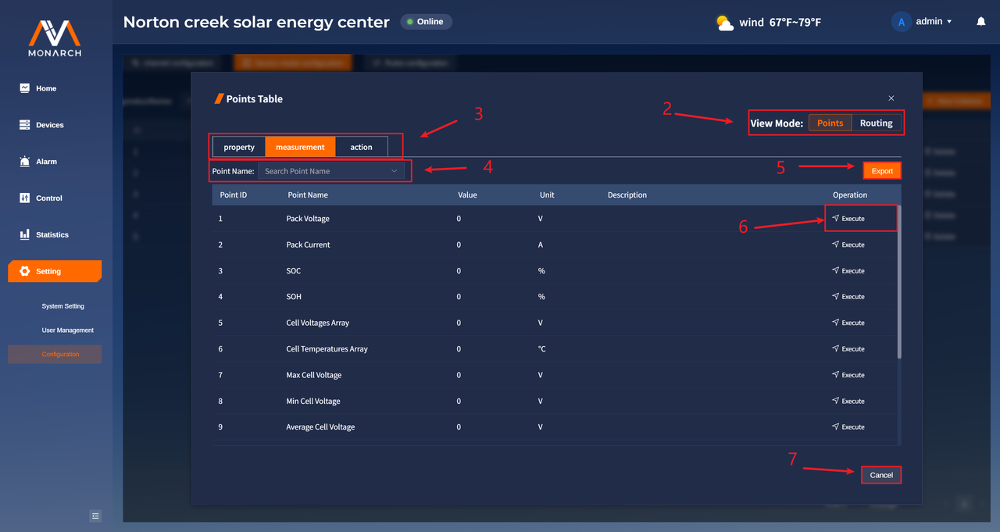
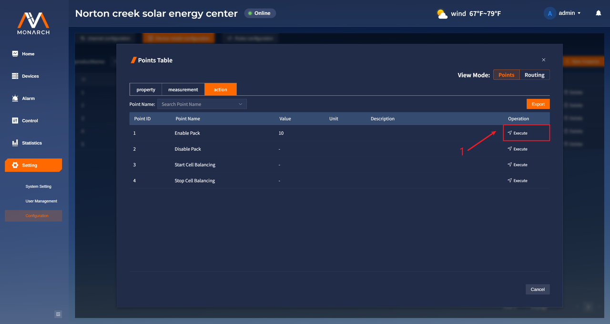
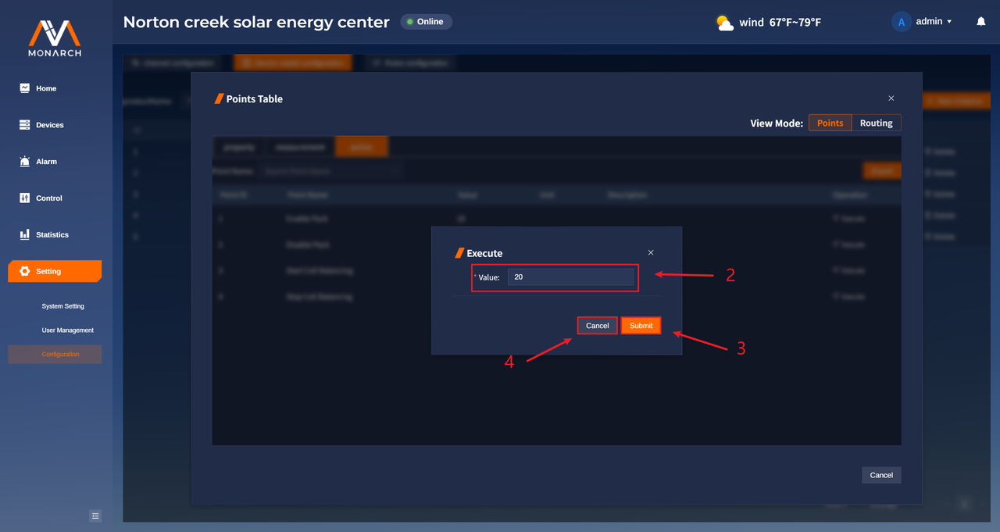
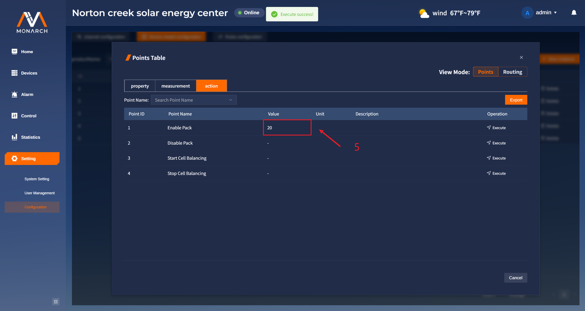
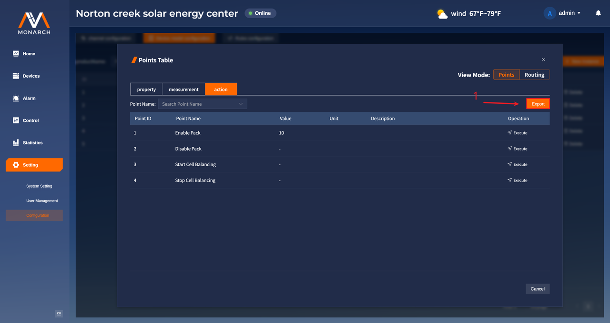
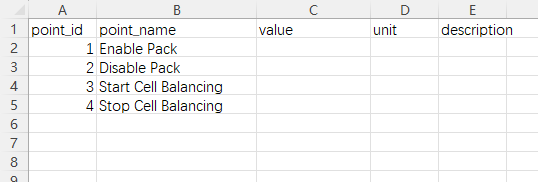

# 实例点位配置

实例点位配置页面用于管理设备实例内部的 property/measurement/action 点位，是实例运行参数查看与操作执行的关键页面。
通过本页面，您可以：

- **在多种点位类型间切换查看**：按业务需要查看属性点、测量点和动作点
- **快速检索目标点位**：支持按名称筛选，提升点位定位效率
- **执行动作点命令下发**：可直接对 action 点位发起执行并观察结果变化
- **导出点位数据**：将当前视图导出为 CSV，便于分析、留档与交付

1. 通过点击想要查看的设备实例行**Operation**列的**Points**按钮，打开点位弹框。

2. **View Mode** 选框用于切换视图，视图分为点位视图和点位路由视图，点击按钮进行切换（默认为点位视图）。
3. 用于切换表格中展示的点位类型的标签按钮，在点位视图中有三个标签：**Property**、**measurement**、**action**。
4. 点位筛选框，可以手动输入进行点位名称的模糊搜索或者通过下拉框对点位名称的选择进行精准搜索。
5. **Export**按钮，用于把当前点位类型表格数据以csv的格式进行导出。
6. **Execute**按钮，用于执行下发点位值。
7. **Cancel**按钮，用于关闭弹框。

## 点位命令下发

2. 点击所要执行某一数值的点位所在行**Operation**列的**Execute**按钮，打开执行弹框。
3. 输入要执行的值（数字）。
4. 点击**Submit**按钮进行提交。
5. 点击**Cancel**按钮取消提交。
6. 提交成功后值发生变化。

## 导出点位CSV文件

1. 点击**Export**按钮，将当前显示的表格数据进行导出，导出的**.csv文件**的文件名格式为：**实例名称_点位类型（property/measurement/action）_points_当前时间戳.csv**，文件如下图所示：

