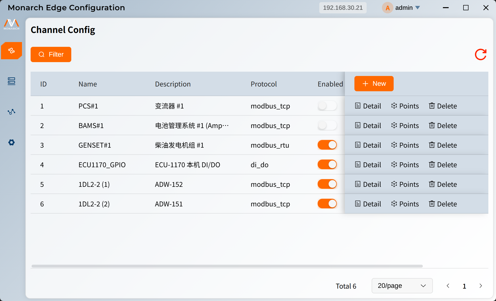
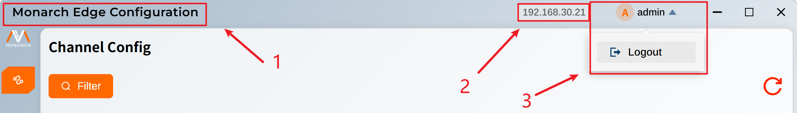

# 应用介绍

**EMS Edge Configuration** 是一款用于边缘侧配置与运行维护的桌面平台，主要面向运维人员、现场工程师与配置管理员。  
它的核心作用是提供统一的配置入口、清晰的运行视图与规范的操作流程，帮助用户更高效地完成设备与通道的配置管理、规则维护与状态监控。

## 下载地址（V.1.13版本）

- **Windows**
  - https://edge-desktop-configuration-application.s3.us-east-2.amazonaws.com/releases/v0.1.13/windows/pcmanagement_0.1.13_x64_en-US.msi （.msi）

- **macOS**
  * dmg: https://edge-desktop-configuration-application.s3.us-east-2.amazonaws.com/releases/v0.1.13/macos/pcmanagement_0.1.13_aarch64.dmg (.dmg)
- **Linux**
  * https://edge-desktop-configuration-application.s3.us-east-2.amazonaws.com/releases/v0.1.13/linux/pcmanagement_0.1.13_amd64.AppImage (.AppImage)
- **Linux-arm64**
  * https://edge-desktop-configuration-application.s3.us-east-2.amazonaws.com/releases/v0.1.13/linux-arm64/pcmanagement_0.1.13_aarch64.AppImage (.AppImage)

## UI 介绍

### 顶部标题栏

1. **应用标识区**：显示应用名称与基础状态提示。  
2. **当前所连网关机的IP**：在登录时进行设定，所有的操作都将基于该网关机进行。  
3. **用户控件**：查看用户名称，点击弹出下拉框，可进行退出登录的操作。  

### 侧边栏

用户可以点击侧边栏的标签选择不同的模块进行操作。侧边栏有两种形态，其会随着应用窗体的大小发生变化：

* 在应用窗口较宽时，会以`图标+模块名称`的形式来展示模块标签。

  

* 在应用窗口较窄时，会以图标的形式来展示模块标签。

  

