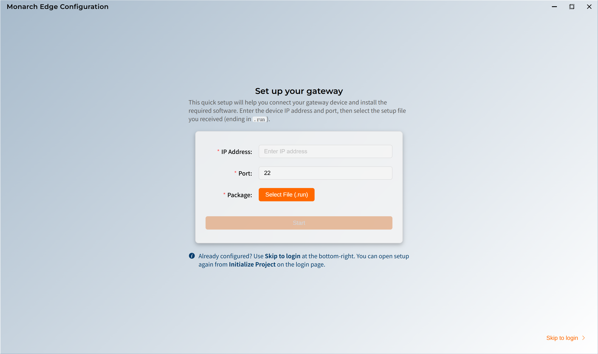
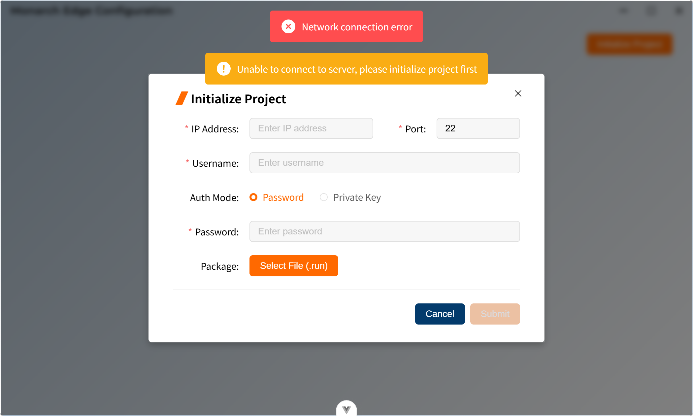
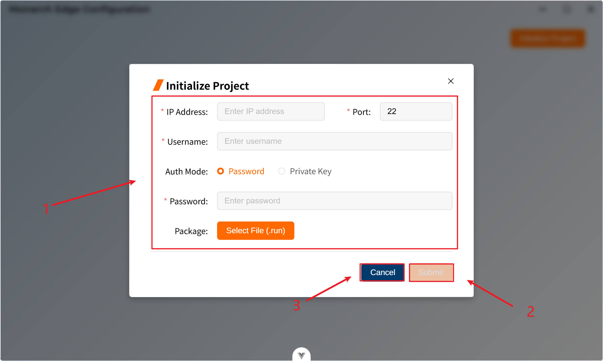
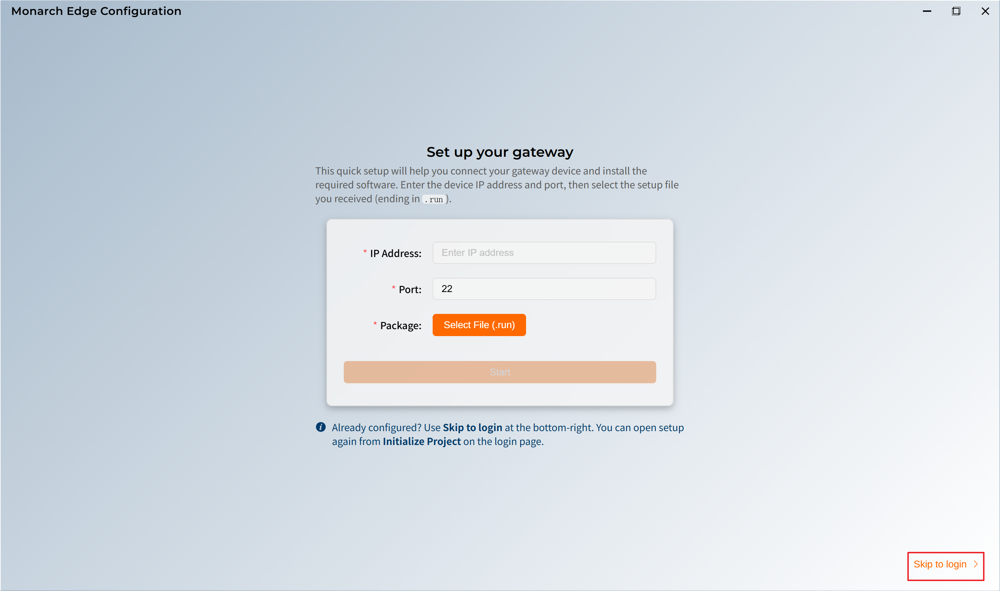
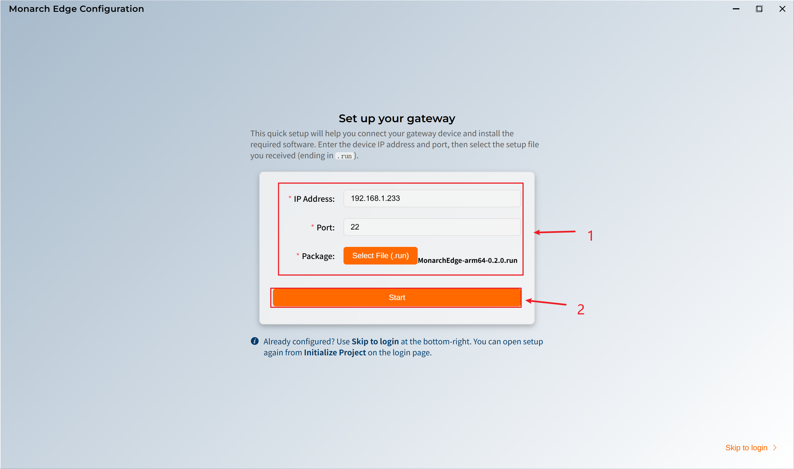
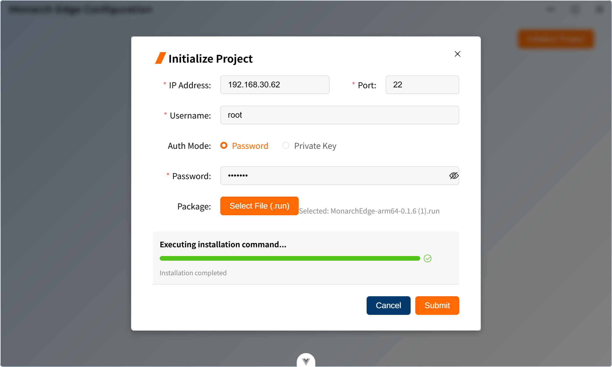
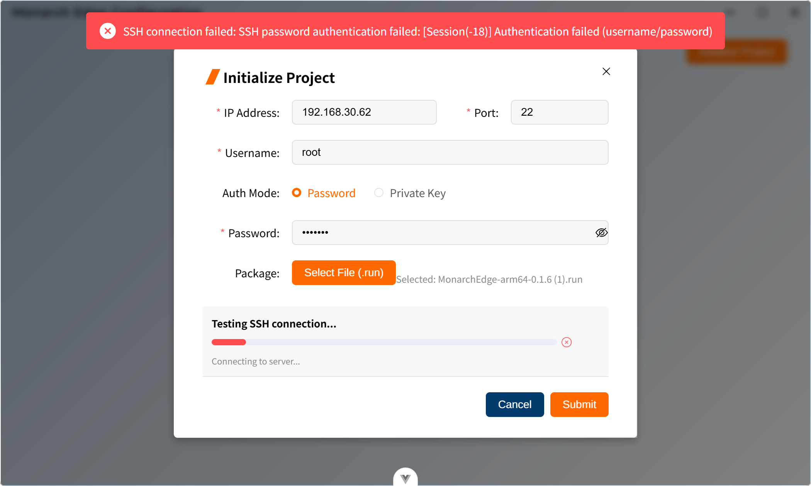

# 初始化配置

初始化配置功能用于首次部署或重新配置后端服务器。通过SSH连接远程服务器，自动部署和配置后端服务。

**使用场景：**
- 首次安装系统
- 服务器重新部署
- 服务器配置变更

## 打开初始化对话框

有两种方式打开初始化对话框：

**方式 1：从登录界面**



1. 在登录界面右上角点击 **Initialize Project** 按钮，打开初始化对话框。

**方式 2：从错误提示**



1. 当登录失败且提示网络错误时,系统会提示"**Unabel to connect to server,please initialize project first**"，之后会自动打开初始化弹框。

## 初始化配置步骤



1. 初始化配置表单包含以下内容：

   * `IP Address`：网关机的IP地址，格式类似为`192.168.1.100`，必须符合IP地址格式。

   * `Port`：**SSH**连接端口，默认值为`22`，范围为1-65535。

   * `Username`：**SSH** 登录用户名，通常是`root`或其他有权限的用户。

   * `Auth Mode`：**SSH **认证方式，系统支持**Password**认证和**Private Key**认证者两种认证方式

     * **Password** 认证：在**Password**输入框中输入**SSH**密码。

       

     * **Private Key** 认证：点击**Select Private Key File**按钮，选择私钥文件（`.pem`或.key`格式`）。

       

   * `Package`：网关机配置安装包，点击**Select Installation Package**按钮进行安装包文件的选择，安装包必须是`.run`格式

   > **针对内部测试：**
   > - **IP Address**: ```192.168.1.233```
   > - **Port**: ```22```
   > - **Username**: ```root```
   > - **Auth Mode**: ```Password```，```Password``` **无需填写**
   > - **Package** 选择 ```.run 文件```，[点击下载.run文件](https://github.com/EvanL1/VoltageEMS/releases/download/v0.1.11/MonarchEdge-arm64-0.1.11.run) 

2. 点击**Submit**按钮开始初始化，系统会显示进度信息，此时用户不能中断初始化的进行。

   * 当初始化成功的时候，进度条会变为绿色，初始化成功，今天提示。

     

   * 当初始化失败的时候，进度条会变为红色，初始化停驶，同时提示错误信息。

     

>注意事项：
>
>1. 初始化过程中请勿关闭对话框。
>2. 确保服务器可以正常访问。
>3. 确保SSH服务正常运行。
>4. 安装包文件必须是有效的`.run`格式。
>5. 私钥文件必须是`.pem`或`.key`格式。
>6. 初始化完成后，可以尝试重新登录。
