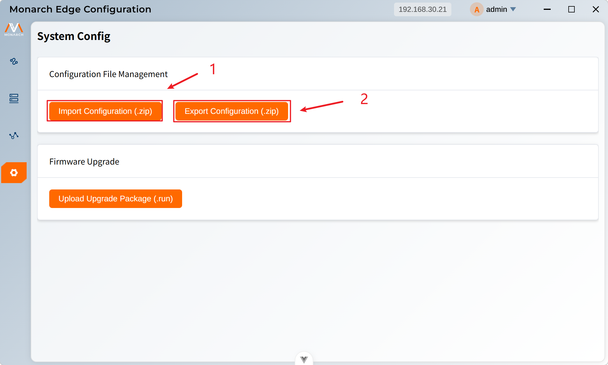

# 配置文件管理

**导入**：从本地导入系统配置文件（.zip格式），用于恢复系统配置或应用预设配置。

**导出**：将当前系统配置导出为`.zip`文件，用于备份或迁移配置

1. 点击**Import Configuration (.zip)**按钮，在文件选择对话框中选择`.zip`格式的配置文件进行导入。
2. 点击**Export Configuration (.zip)**按钮，系统会开始导出配置。导出完成后，系统会自动下载配置文件，文件名格式：`system_config_时间戳.zip`，其会被保存到浏览器的默认下载目录。
