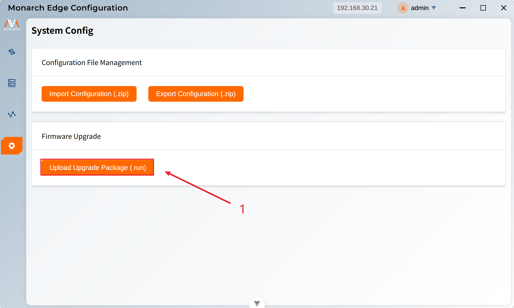
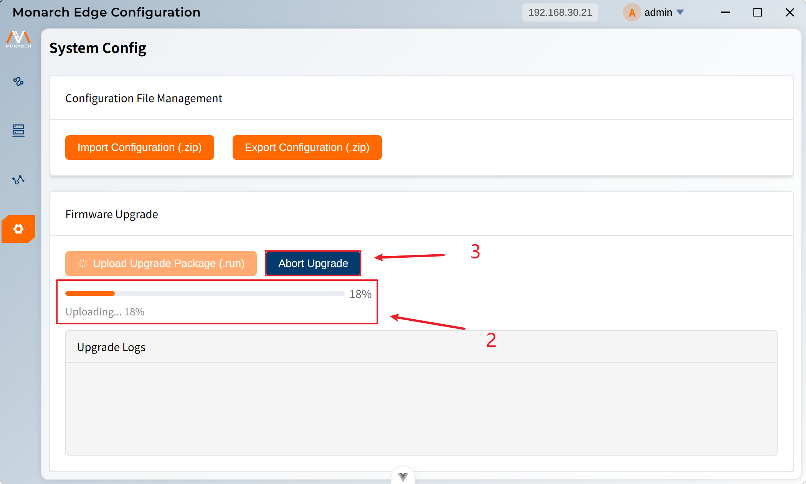

# 固件升级

固件升级功能用于升级系统固件，提升系统性能和修复问题。

1. 点击**Upload Upgrade Package (.run)**按钮，在文件选择对话框中选择`.run`格式的升级包。

2. 显示当前上传文件的进度。
3. 点击Abort Upgrade按钮，可以终止本次升级。

4. 升级过程中会显示相关日志信息。

5. 目前暂时无法确认具体的升级情况，需要自行通过日志输出来进行判断。

>注意事项：
>
>1. **升级过程中请勿关闭窗口**：升级过程中关闭窗口可能导致升级失败或系统异常。
>
>2.  **确保网络稳定**：升级需要稳定的网络连接。
>
>3. **备份重要数据**：升级前建议备份重要配置和数据。
>
>4. **确认升级包版本**：确保升级包版本正确且适用于当前系统。
>
>5. **查看升级日志**：升级过程中注意查看升级日志，及时发现问题。
>
>6. **升级时间**：升级可能需要较长时间，请耐心等待。
