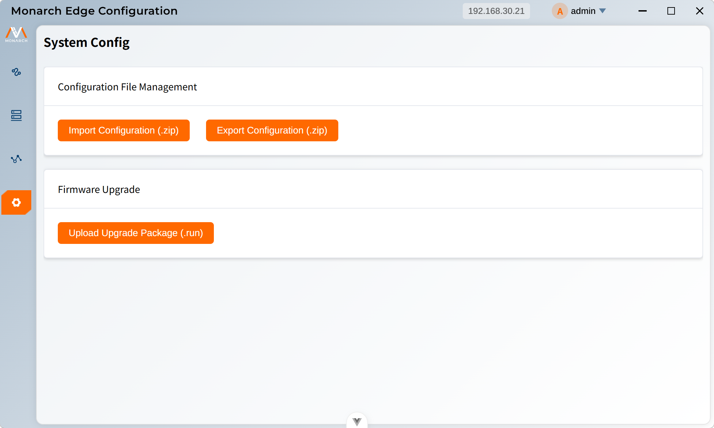

# 系统配置界面

系统配置界面提供了系统级别的配置管理功能，包括配置文件管理和固件升级。

**访问路径：** 登录后，通过侧边栏导航进入**System Config**页面

**主要功能：**

- **Configuration File Management**模块：配置文件导入/导出
- **Firmware Upgrade**模块：固件升级

## 功能模块

- [配置导入导出](./configuration.html) - 系统配置文件的导入和导出功能
- [固件升级](./firmware-upgrade.html) - 系统固件升级功能
- [常见问题](./faq.html) - 系统配置相关常见问题解答
