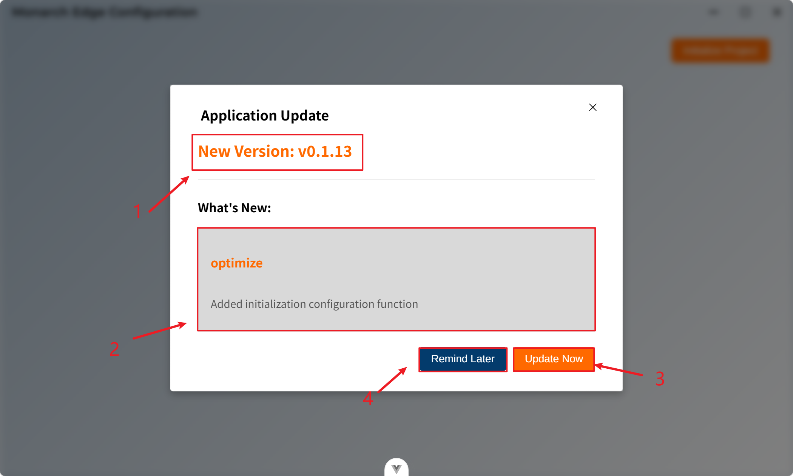

# 应用更新

系统支持自动检查更新和手动更新两种方式。当有新版本可用时，系统会自动提示您进行更新。

**更新类型：**

- 应用版本更新（通过桌面应用的更新机制）
- 固件升级（通过系统配置）

## 自动更新检查

### 自动检查机制

系统会在以下时机自动检查更新：
- 应用启动后3秒（静默检查）
- 不会影响应用启动速度

### 更新流程

当检测到新版本时，系统会显示更新对话框，如图所示：

1. 应用最新的版本号。
2. 更新对话框，其中会显示详细的更新日志，包括：
   - 新功能
   - 问题修复
   - 性能改进
   - 其他变更
3. 点击**Update Now**按钮，会立即进行应用的更新操作，系统开始下载更新包，下载过程中会显示进度提示。
4. 点击**Remind Later**按钮，会暂时取消更新。

5. 下载完成后，系统会提示需要重启应用
6. 选择**Restart Now**立即重启应用完成更新
7. 或选择**Restart Later**稍后重启

>注意：
>
>1. 更新过程中请勿关闭应用
>2. 建议在更新前保存重要数据
>3. 更新完成后需要重启应用才能生效
>4. 如果当前版本已是最新版本，系统会提示"当前版本已是最新版本"
