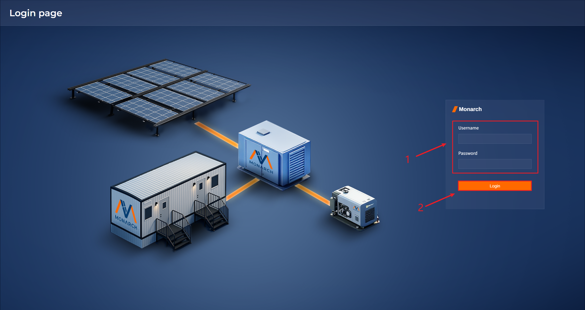

<h1>Monarch Edge User Manual</h1>


 **Monarch Edge** is a comprehensive monitoring and analytics platform for edge energy sites, designed to provide users with a clear, unified, and visual view of site operations. The platform covers key business scenarios such as generation, energy storage, energy usage, and alarms. With standardized interfaces and consistent interactions, the Monarch Edge improves daily O&M efficiency and management quality by helping users quickly understand device status, operational trends, and abnormal conditions.

  The platform's main capabilities include:

- **Site overview**: Centralized display of energy summary, energy flow, power/energy trends, and site/device highlights to quickly assess operational health.
- **Device monitoring**: Overview and value-monitoring pages by device type (PV, storage, meters, diesel generators, etc.), supporting real-time data and status viewing.
- **Alarm management**: Separate current and historical alarms with query, filter, and export for troubleshooting and traceability.
- **Operation statistics**: Statistical overview, curve analysis, and run/operation logs to support data review and trend analysis.
- **Unified experience**: Consistent interactions such as table filters, pagination, and update-time hints to reduce learning cost.

<h2>Basics</h2>

<h3>UI Structure and Function Description</h3>


The main home page of the user interface is divided into three parts:

1. **Left side: Sidebar menu**

  - Users can click the modules they want to open. **Devices**, **Alarm**, **Control**, and **Statistic** have secondary menus. The menu corresponding to the current page is highlighted. The menu items are as follows:
    <div style="display:flex; gap:16px; align-items:flex-start; flex-wrap:wrap;">
      <div style="min-width:260px; flex:1;">
        <ul>
          <li><strong>Home</strong></li>
          <li>
            <strong>Devices</strong> 
            <ul>
              <li><strong>PV</strong></li>
              <li><strong>Battery</strong></li>
              <li><strong>Diesel Generator</strong></li>
              <li><strong>Meter1</strong></li>
              <li><strong>Meter2</strong></li>
            </ul>
          </li>
          <li>
            <strong>Alarm</strong>
            <ul>
              <li><strong>Current Records</strong> </li>
              <li><strong>History Records</strong></li>
            </ul>
          </li>
          <li>
            <strong>Control</strong>
            <ul>
              <li><strong>Control Record</strong></li>
            </ul>
          </li>
          <li>
            <strong>Statistics</strong>
            <ul>
              <li><strong>Overview</strong></li>
              <li><strong>Curves</strong></li>
              <li><strong>Operation Log</strong></li>
              <li><strong>Running Log</strong></li>
            </ul>
          </li>
        </ul>
      </div>
    </div>
  
  - Users can resize the sidebar width via the zoom icon at the bottom-right of the sidebar.

  <span style="display:inline-flex; gap:40px; align-items:center; white-space:nowrap;">
    
    
  </span>

2. **Upper-right: Top bar**

   


* Users can view the global basic information in this module, which is presented from left to right as follows:

    - Platform Name

    - Current status of the site
    - Station weather conditions
    - The currently logged-in user can click to pop up an operation dialog box, which enables them to perform the logout operation
    - Alert quantity notification. Click to jump to the current alert page.


3. **Lower-right: Main content area**
  - Displays data for the current page.

<h3>Channel Concepts</h3>

In an IoT system, terminal devices, data acquisition gateways, and cloud platforms need to communicate through various methods for data collection, remote control, and device status monitoring. To standardize device onboarding and data management, the platform draws on proven experience in Industrial IoT (IIoT) and power automation (SCADA) and introduces concepts such as **Channel, Channel Point, Protocol, Four Remote types (Telemetry/Signal/Control/Adjustment), and Mapping**.

These concepts form the core logic for communication between devices and the cloud, and are key to understanding device onboarding, point configuration, data formats, and gateway behavior.

<h4>Channel</h4>

<h5>Definition</h5>

A channel is the **logical link** used to establish communication between a device (or gateway) and the platform, and it includes the complete configuration required for read/write operations. In simple terms, a channel defines:

- which protocol is used to communicate with the device;
- how to connect to the device;
- what parameters are used for read/write operations;
- how to keep the connection alive and retry on errors. 

A channel is the foundation of device communication and a prerequisite for all point read/write operations.

<h5>Configuration Items</h5>

**Basic Information:**

- `id`: Unique identifier of the channel
- `name`: Channel name
- `description`: Channel description
- `protocol`: Protocol used by the channel. Supported protocols include `modbus_tcp`, `modbus_rtu`, and `di_do`
- `enabled`: Whether the channel is enabled

**Parameters**(Dynamically change based on **protocol**):

- modbus_tcp
  - `host`: Host address (IP/domain)
  - `port`: Port (default 502). Range: 1-65535
  - `connect_timeout_ms`: Connection timeout (positive integer, milliseconds)
  - `read_timeout_ms`: Read timeout (positive integer, milliseconds)
- modbus_rtu
  - `device`: Serial device path (e.g., /dev/ttyS0, COM3)
  - `baud_rate`: Baud rate (typical values: 9600/19200/38400/115200)
  - `data_bits`: Data bits (commonly 8)
  - `stop_bits`: Stop bits (1 or 2)
  - `parity`: Parity (N=None, E=Even, O=Odd)
  - `connect_timeout_ms`: Connection timeout (positive integer, milliseconds)
  - `read_timeout_ms`: Read timeout (positive integer, milliseconds)
  - `retry_interval_ms`: Retry interval after read/write failure (positive integer, milliseconds)

**Running Status:**

- `connected`: Whether the channel is connected (Connected/Disconnected)
- `running`: Running status (Running/Stop)
- `last_update`: Last update time
- `error_count`: Error count
- `last_error`: Last error message

**Point Counts:**

- `telemetry`: Telemetry point count
- `signal`: Signal point count
- `control`: Control point count
- `adjustment`: Adjustment point count

<h5>Role of Channels</h5>

The entire communication process depends on channels, including:

- how the platform or gateway establishes connections (serial / TCP / RTU / Ethernet);
- how data is read from devices;
- how data is written or commands are issued to devices;
- how communication status is monitored and exceptions are handled. 

In plain terms: Channel = "link + protocol + parameters" required for device communication.

<h4>Four Remote Types</h4>

<h5>Definition</h5>

In industrial automation, power systems, and IoT device management, business data is typically organized and managed by the "four remote" categories. The four-remote model is a classic SCADA data model and is widely used in IIoT platforms, power automation, water, HVAC, energy management systems, and more. The classification clarifies the "nature and purpose of points," helping users understand what each point represents, what it can do, and how it is collected or issued.

<h5>Category</h5>

<h6>Telemetry</h6>

Telemetry refers to continuous, analog, and measurable real-time values reported by devices. It is generally represented by numeric values (integer or float).

**Common Examples**

- Temperature (C)
- Humidity (%RH)
- Voltage (V), Current (A)
- Power (kW), Power factor
- Pressure (kPa), Level (%)
- Flow, Wind speed, RPM
- Energy readings (electricity, gas, water, etc.)

**Characteristics**

- Mostly read operations;
- Values change in real time with device operation;
- Collection intervals typically need to be configured. 

Usage in the platform Telemetry points are used for trend analysis, reporting, energy monitoring, and operational optimization.

<h6>Signal</h6>

Signals are discrete status information such as device state, switch status, or enumeration values. Typically there are only two states (0/1), though some may extend to a small number of enumerations.

**Common Examples**

- Running/Stopped
- Close/Open
- Started/Not started
- Alarm/Normal
- Fault/Normal
- Door Open/Closed
- Relay Energized/Released

**Characteristics**

- Mostly read operations;
- Used for monitoring device status;
- Change events can trigger alarms. 

Usage in the platform Signal points are widely used in alarm management, event monitoring, and status recording.

<h6>Control</h6>

Control refers to action commands issued by the platform to change device operating status. This is a write operation.

**Common Examples**

- Start/stop equipment
- Open/close valves
- Close/open breakers
- Start ventilation, drainage, heating equipment
- Reboot controllers
- Switch modes

**Characteristics**

- Requires permission control;
- Often requires secondary confirmation or safety checks;
- Mostly switch-type commands (0/1). 

Usage in the platform Control is used for intelligent operations, remote management, and automated control strategy execution.

<h6>Adjustment</h6>

Adjustment is remote parameter tuning used to set device operating parameters. It is also a write operation, but unlike Control, Adjustment acts on internal "setpoints".

**Common Examples**

- Temperature setpoint
- Pressure upper/lower limits
- Frequency setpoint (Hz)
- Voltage/current protection thresholds
- Tariff parameters (meters)
- PID control parameters (P/I/D)

**Characteristics**

- Parameter-type writes rather than switch actions;
- Greater impact on device performance;
- Typically requires range and type validation. 

Usage in the platform Adjustment is often combined with automation strategies to regulate environments and improve energy efficiency.

<h4>Channel Points</h4>

<h5>Definition</h5>

A channel point is a real data point of a device under a specific protocol (actual register address or signal address). A point is the smallest unit for data acquisition and command delivery. For example, in Modbus:

- Voltage may be at address 40001
- Current may be at address 40002
- Device start/stop may be at 00001 (coil) 

These registers or flags are channel points.

<h5>Point Classification</h5>

The platform classifies points according to the "four remote" standard in industrial automation:

| Type       | Name       | Description                                                  |
| :--------- | :--------- | :----------------------------------------------------------- |
| Telemetry  | Telemetry  | Read-only.Continuous/analog values (e.g., temperature,voltage)         |
| Signal     | Signal     | Read-only.Discrete/switch values (e.g., on/off, alarm)                 |
| Control    | Control    | Write-only.Control commands issued by the platform (e.g., start/stop)   |
| Adjustment | Adjustment | Write-only.Parameter setpoints issued by the platform (e.g., frequency or voltage setpoint) |

> **Note: For `di_do` channels, point types are only Signal and Control because the values are only 0 and 1.**

<h5>Field Description</h5>

Each channel point typically includes:

- `point_id`: Unique point ID (positive integer)
- `signal_name`: Business signal name
- `value`: Current value of the point
- `scale/offset`: Scaling and offset for converting raw values to business values
- `unit`: Unit of the point
- `reverse`: Whether the value should be inverted (commonly for switch points)

> **Note: For Signal and Control points, the `scale`, `offset`, and `unit` fields are not required.**

<h4>Channel Point Mapping</h4>

<h5>Definition</h5>

Because different device vendors use different register addresses and protocol structures, the platform maps "device actual points" to a unified data model. Channel mapping is used to:

- Convert raw point to a unifies format

- Convert protocol addresses to platform standard addresses

- Multi-register merge, scaling, unit conversion, and more

  The platform converts device-level register data into a unified structure through mapping rules, providing standard input for historical data, alarms, and formula calculations.

<h5>Field Description</h5>

Mappings differ by protocol:

**modbus_rtu/modbus_tcp**:

- `point_id`: Unique point ID (positive integer)
- `slave_id`: Slave ID in Modbus and similar protocols
- `data_type`:  Data type such as int16, uint16, int32, uint32, float32, int64, uint64, float64, bool
- `byte_order`: Byte order such as AB, BA, ABCD, CDAB, etc
- `function_code`: Register function code for different functions
  - `01`: Read Coils, for read/write 1-bit outputs
  - `02`: Read Discrete Inputs, for read-only 1-bit inputs
  - `03`: Read Holding Registers, for read/write 16-bit register data (setpoints/parameters)
  - `04`: Read Input Registers, for read-only 16-bit register data (measurements)
  - `05`: Write Single Coil, for writing one 1-bit output
  - `06`: Write Single Holding Register, for writing one 16-bit register value
  - `15`: Write Multiple Coils, for writing multiple 1-bit outputs in batch
  - `16`: Write Multiple Holding Registers, for writing multiple 16-bit register values in batch
- `register_address`: Register address where data is stored, usually 1-65535
- `bit_position`: Bit position of the real value, used for switch points, range 1-15

**di_do**:

- `point_id`: Unique point ID (positive integer)
- `gpio_number`: The global GPIO line number in Linux, allowing users to reference an IO line by a single number; not the same as the physical pin/chip pin.

**These items determine how the platform correctly parses raw device data into usable business data.**

<h3>Device Instance Concepts</h3>

In microgrid EMS, to standardize device onboarding and point management, the platform defines four core concepts: **product, instance, instance point, and point mapping (binding)**. A **product** specifies the standardized capabilities and point model for a device type. An **instance** is a concrete on-site device object created from a product. **Instance points** describe the instance’s configuration, runtime states/telemetry, and supported operations, and are categorized by usage as **property / measurement / action**. **Point mapping (binding)** associates each instance point with a specific on-site channel point, and labels the binding with a **T/S/C/A** semantic type to ensure correct data ingestion/reporting and correct command/setpoint dispatch.

<h4>Product</h4>

<h5>Definition</h5>

A product is a standardized model for a device/system type in the platform, used to abstract the capabilities and data interfaces that this type should have in the EMS. A product does not represent a specific on-site device, but rather the common structure and standard interface of the same device type. It defines what the device looks like in the platform and what capabilities it has:

- What points it includes (property points, measurement points, action points)

- What each point represents (e.g., SOC, power, alarms, start/stop, power setpoints, etc.) A product is not a specific on-site device, but a "generic definition for similar devices." The platform provides the following products:

  - **battery_cell(cell)**
  
    - Definition: The smallest electrochemical unit of a battery system.
    - Role: Provides the most basic voltage/temperature data, the foundation for BMS monitoring and safety evaluation.
  
  - **battery_module (battery module)**
  
    - Definition: A structural and electrical unit composed of multiple cells.
    - Role: Aggregates cell-level data, commonly used for module voltage, temperature distribution, balancing/protection management and display.
  
  - **battery_cluster(battery cluster/battery bank)**

    - Definition: A higher-level aggregation composed of multiple battery modules (often corresponding to the scope of one cluster BMS).
    - Role: Provides cluster-level SOC/SOH, voltage/current, alarms, enabling EMS strategy and safety coordination.
  
  - **battery_stack(battery stack/string)**
  
    - Definition: A system-level series/parallel unit composed of multiple battery clusters (often one battery stack in engineering practice).
    - Role: Provides system-level DC key metrics (total voltage/total current/total power) and stack-level alarms for coordination with PCS/DC conversion.
  
  - **battery_pack(battery pack/battery system pack)**
  
    - Definition: A more asset/system-oriented abstraction for the battery side in EMS (often used to summarize the overall capability of a BESS battery system).
    - Role: Used for capacity, ratings, runtime statistics, alarm aggregation, reporting, and asset management; often serves as the top-level battery object for BESS.
  
    >The relationship among battery cell, battery module, battery cluster, battery stack and battery pack is shown in the figure.
    >
    >
    >
    >
  
  - **dc_dc_converter(DC/DC converter)**
  
    - Definition: DC-to-DC power conversion equipment (boost/buck/isolation, etc.).
  
    - Role: Matches different DC bus voltage levels and supports energy regulation and protection coordination; commonly used in battery-side/DC bus power control loops.
  
  - **pcs(power conversion system)**
    - Definition: Core power conversion equipment in energy storage systems (DC-AC).
    - Role: Executes charge/discharge power control, grid-connected/off-grid operation, reactive support, and power quality control; key target for EMS strategies and execution.
  - **diesel_generator(diesel generator)**
    - Definition: Controllable backup/emergency/peak-shaving power source.
    - Role: Provides stable power in off-grid or weak-grid scenarios; supports start/stop control, power regulation, operating status, and fault monitoring.
  - **motor(motor)**
    - Definition: Motor-type load/device (as a drive device or key process device abstraction).
    - Role: Used to monitor operating status, power/current, etc.; some scenarios support start/stop or speed control (depending on site control and points).
  - **load (load)**
    - Definition: Aggregated load or controllable load object on the consumption side (e.g., campus load, building load, production line load).
    - Role: Core input for EMS load forecasting, energy balance, peak shaving, and demand response; supports strategy linkage when extended as controllable load.
  - **pv_string(PV string)**
    - Definition: A generation unit formed by series-connected modules.
    - Role: String-level voltage/current/power monitoring, helpful for locating shading, mismatch, and degradation issues (depending on access capability).
  
  - **pv_optimizer(optimizer)**
    - Definition: Module/string-level power optimization and monitoring device.
  
    - Role: Improves generation efficiency and supports finer-grained monitoring and fault localization; typically associated with string/module data.
  
  - **pv_combiner(combiner box)**
    - Definition: Device that combines multiple strings in parallel to a DC bus.
    - Role: Aggregates string circuits and provides branch current/switch/surge protection monitoring; key node between strings and inverters.
  
  - **pv_inverter(PV inverter)**
    - Definition: Device that converts PV DC power to AC for grid connection/supply.
    - Role: Output power control, grid operation management, reactive/power-quality support, and status/alarm monitoring; main controlled/monitored object on the PV side in EMS.
  - **gateway(gateway)**
    - Definition: Acquisition and protocol conversion node connecting site devices to the cloud/platform.
    - Role: Hosts channels and protocols, performs data acquisition upload and command delivery; responsible for point mapping, caching, edge computing/forwarding (depending on implementation).
  
  - **station(site/station)**
    - Definition: Top-level organizational object for a microgrid/site (one project or one station).
    - Role: Hosts the site device tree, topology, and aggregate metrics (site power/energy/alarms), and serves as the unified entry for permissions, reporting, dispatch strategies, and O&M.

<h5>Role</h5>

- Unify point collections and semantics for the same device type (standardization)
- Support bulk instantiation (multiple device instances for one product)
- Facilitate system integration, operations, and configuration reuse

<h4>Instance</h4>

<h5>Definition</h5>

An instance is the concrete object of a product model in a site project (Asset/Device Instance), corresponding to an actual device, system unit, or logical object (e.g., PCS_01, BESS_01, PCC_METER_01). An instance has a unique `instance_id` and binds to a `product_name`, inheriting the product's point system. An instance is not only a display "device item" but also the smallest business unit for status calculation, control issuance, and alarm positioning on the platform.

<h5>Field Description</h5>

- `insance_id`: Instance ID, a unique identifier
- `instance_name`: Instance name
- `product_name`: Name of the product the instance belongs to
- `properties`: Instance properties

<h5>Role</h5>

- Apply the "template (product)" to the "site object (instance)"
- Carry the product's configuration properties and runtime points (measurement/action)
- Map to site channels (four-remote) to enable data acquisition and control issuance

<h4>Instance Points</h4>

<h5>Definition</h5>

Instance points are the "data interfaces" of an instance in the platform, representing all information that can be configured, observed, and controlled. Instance points fall into three categories:

- **Property points**

  Describe "static/semi-static configuration parameters" such as rated power, capacity, communication address, control strategy parameters, alarm thresholds, etc. Its function is:

  - To serve as the source of instance configuration data
  - To be used for strategy calculation, limit checks, display, and operations configuration
  - Usually not for high-frequency changes (can be set manually or by strategy)

- **Measurement points**

  Represent "observable status/telemetry/signal" data such as voltage, current, power, SOC, switch status, alarm status, etc.Its function is:

  - Real-time monitoring and visualization
  - Input data for alarms, linkage, reporting, and optimization dispatch

- **Action points**

  Represent points that can be issued for control/adjustment, such as start/stop, close/open, active/reactive setpoints, charge/discharge power setpoints, mode switching, etc. Its function is:

  - EMS control-loop output (strategy/manual operation -> device)
  - To support both Control and Adjustment commands

<h5>Field Description</h5>

- `point_id`: Unique identifier within the point category
- `name`: Point name
- `value`: Current point value
- `unit`: Point unit
- `description`: Point description

<h5>Role</h5>

- Unify semantics and data governance: Map different protocols and vendor raw points into consistent semantic points for upper-layer understanding and reuse.
- Base granularity for monitoring and alarms: Trends, threshold alarms, event linkage, and reporting all rely on points.
- Input/output for the control loop: Strategies read **measurement** points to determine state and write to **action** points to issue targets.

<h4>Instance Point Routing</h4>

<h5>Definition</h5>

Instance point mapping binds platform "instance points" to on-site "channel points/addresses." It answers the following key questions for each instance point: **Which channel and point on-site does it map to? Which of the four remote types does it belong to?**

- For **measurement** points, the channel point type can only be **Telemetry** or **Signal**.
- For **action** points, the channel point type can only be **Control** or **Adjustment**.
- **Property** points are intrinsic attributes and have no routing info.

<h5>Field Description</h5>

- `point_id`: ID of the instance point
- `name`: Name of the point
- `channel_id`: ID of the channel used by the route
- `channel_type`: Four-remote type of the channel point
- `channel_point_id`: Channel point ID used by the route

<h5>Role</h5>

- Data uplink (acquisition): Channel data is routed to the corresponding measurement points.
- Command downlink (control): Values written to action points are routed to the corresponding channel points and sent to devices.
- Decouple business and protocol: Business logic focuses on point semantics; communication focuses on addresses; mapping connects them to allow protocol/gateway/point-table changes.

<h3>Rule Concepts</h3>

In EMS systems, devices such as batteries, PCS, PV, and diesel generators must cooperate under constantly changing operating conditions. The system must make judgments based on real-time measurements and promptly issue control commands or adjust operating parameters (such as power setpoints, start/stop, mode switching) to achieve safe, stable, and economical operation. To standardize strategy configuration and visual management, the platform introduces concepts such as **Rule** and **Rule Flow**.

<h4>Rule</h4>

<h5>Definition</h5>

A rule is the basic unit used in EMS to express an "operating strategy." It describes the control logic the system should take under specific conditions. It takes real-time data (measurements/status/computed results) as inputs, determines the current scenario through conditions, and outputs corresponding control actions or parameter adjustments.

<h5>Role</h5>

- Strategy solidification and automated execution: Configure human experience/dispatch strategies into logic that the system can execute automatically for unattended operation.
- Operational objectives: Automatically choose appropriate control measures under different conditions to meet safety, stability, economy, and efficiency goals.
- Unified management and reuse: Rules can be centrally managed (enable/disable, priority, etc.) and reused across different sites or projects.

<h4>Rule Chain</h4>

<h5>Definition</h5>

A rule chain is the visual execution flow inside a rule. It uses "nodes + links" to describe the full execution path of a rule from start to finish. It breaks a rule into steps (such as start, condition, action, end) and uses branching to express different paths under different conditions.

<h5>Role</h5>

- Clearly express complex logic: Present multi-condition, multi-branch, multi-action strategies as flowcharts, reducing understanding and configuration costs.
- Traceable and diagnosable: During runtime, the actual execution path and key node data can be located to quickly identify why a decision was made.
- Easy to maintain and iterate: Quickly adjust steps and branches with a graphical structure, with versioning and import/export reuse.

<h3>Glossary</h3>

- **Viewer**: Read-only user, mainly views data and records
- **Channel**: Logical channel for acquisition/communication (e.g., a Modbus channel)
- **Point**: Specific measurement/signal point (e.g., a voltage/current line)
- **Telemetry**: Continuous values (usually a number + unit)
- **Signal**: Status values (usually 0/1 or status codes)
- **Control**: Action command issued by the platform to change device operating state
- **Adjustment**: Parameter setpoints issued by the platform for remote tuning
- **SoC**: battery capacity percentage
- **SoH**: State of Health, expressed as a percentage
- **Update Time**: The most recent refresh/push time of page data

<h2>Core Features</h2>

<h3>Login Page</h3>


1. Open the system and enter the login page.

2. Enter:

  - `Username`: The username of the user account
  - `Password`: The password of the user account

3. Click `Log in` to sign in
4. After a successful login, the system will open the **Home** page by default

<h3>Home Page</h3>

The **Home** page mainly displays key data for the site and specific devices, and refreshes in real time with device status.


1. The first section contains the site's energy overview cards, mainly showing statistics for **PV Energy**, **Diesel Energy**, **Energy Used**, and **Saving Billing**.

2. The second section is the microgrid topology diagram. It shows the direction of energy flow (device charge/discharge) and the key data of each device:

   - **PV**: `P` (real-time power,unit: kW)

   - **Load**: `P` (real-time power,unit: kW

   - **ESS**: `P` (real-time power,unit: kW), `SOC` (battery state of charge,unit: %)

   - **Diesel**: `P` (real-time power,unit: kW), `Oil` (real-time diesel fuel percentage,unit: %)

3. The third section is the power statistics curves for **PV** and **ESS**.

4. The fourth section is the energy bar chart for **Diesel**, **ESS**, and **PV**.

5. The fifth section is current site information statistics, covering current power for **PV** and **Diesel**, and the ESS's stored energy.

6. The sixth section is site device information statistics, showing **P (real-time power,unit: kW)** and **U (real-time voltage,unit: V)** for **PV**, **ESS**, and **Diesel Generator**. Users can switch devices using the left/right arrow buttons.

7. The seventh section contains site alarm information, showing active alarms with the following information (left-to-right)::

- Alarm device
- Alarm level (sorted by urgency: **L1>L2>L3**)


* Alarm information

<h3>Devices Page</h3>


**Devices** includes multiple device types, such as **PV**, **Battery**, **Diesel Generator**, **Meter1**, and **Meter2**. Each device page typically includes:

- **Overview**: Card-based display of key device indicators.
- **Value Monitoring**: Real-time point tables showing Telemetry and Signal data from channels bound to real devices.

<h4>PV</h4>

<h5>Overview</h5>


- The top shows four PV indicator cards:
  - **PV Power**: Current PV power
  - **PV Voltage**: Current PV voltage
  - **PV Current**: Current PV current
  - **Today’s Energy**: PV energy generated today
- The middle area shows a PV background diagram. Hovering over a string shows data for that PV string:
  - **P**: Power of the selected PV string
  - **V**: Voltage of the selected PV string
  - **I**: Current of the selected PV string

<h5>Value Monitoring</h5>


- The top right of this section displays Update Time, which is the latest data acquisition time.
- Below are two tables:
  - The left table is the channel **Telemetry** table, including `Name`, `Value`, and `Unit`.
  - The right table is the channel **Signal** table, including `Name` and `Status`.

<h4>Battery</h4>

<h5>Overview</h5>


This page displays key battery indicators in a card list:

- **Status**: Battery charge/discharge status
- **SoC**: Battery state of charge
- **SoH**: Battery health
- **Voltage**: Current battery voltage
- **Current**: Current battery current
- **Power**: Current battery power
- **Max/Min/Avg Cell Voltage**: Max/min/average cell voltage
- **Cell Voltage Difference**: Maximum cell voltage difference
- **Avg Cell Temperature**: Average cell temperature

<h5>Value Monitoring</h5>


This page includes tabs:

- **Battery**: Battery system (aggregated view at pack level or above)

  **PCS**: Power conversion system (bidirectional DC/AC conversion and grid interface control)


Each tab uses the "**Update Time + left/right tables**" layout, the same as the **PV** **Value Monitoring** page.

<h3>Battery Management</h3>


This page mainly monitors **Voltage** and **Temperature** for all **Battery Cells**.

- Left: Shows voltage for all cells
  - The module header identifies which cells have the **maximum cell voltage** and **minimum cell voltage**.
  - The module body lists **#1~#N** (Battery Cell) voltages as cards.
- Right: Shows temperature for all cells
  - The module header identifies which cells have the **maximum cell temperature** and **minimum cell temperature**.
  - The module body lists **#1~#N** (Battery Cell) temperatures as cards.

<h4>Diesel Generator</h4>
<h5>Overview</h5>


Top indicator cards:

- **Power**: Real-time Power,kW
- **Oil**: Real-time fuel percentage,%
- **Voltage**: Real-time voltage,V
- **Coolant Temp**: Real-time coolant temperature,℃

<h5>Value Monitoring</h5>


Layout is the same as the **PV** **Value Monitoring** page.

<h5>Meter1</h5>
**Meter1** directly displays **Value Monitoring** information, with the same layout as the **PV** **Value Monitoring** page.


<h5>Meter2</h5>

**Meter2** directly displays **Value Monitoring** information, with the same layout as the **PV** **Value Monitoring** page.


<h3>Alarm Page</h3>
Alarm is the alarm record page. Users can view current and historical alarm information from this module.

<h5>Current Records</h5>


**Table fields:**

- `Name`: Rule/Alarm name
- `Channel ID`: Channel ID
- `Level`: Alarm level icon
- `Start Time`: Time the alarm was triggered

**Filter：**

Users can select the alarm level from the dropdown in the upper-right corner to filter current alarm records.

<h5>History Records</h5>

**Table fields:**

- `Name`: Rule/Alarm name
- `Channel ID`: Channel ID
- `Alarm Level`: Alarm level icon
- `Start Time`: Alarm trigger time
- `End Time`: Alarm handling end time

**Filter:**

Users can filter by the following conditions:

- `Alarm Level`: L1/L2/L3
- `Start Time`: Start time
- `End Time`: End time

Click **Search** to search by the selected conditions. Click **Reload** to reset all filters and search again.

**Export:**

Click **Export** to export historical alarms to an Excel file.


<h4>Control</h4>
Viewers typically only have permission to view control records and cannot issue control commands.
<h5>Control Record</h5>

`Table fields:`

- `Name`: Rule/Alarm name
- `Channel ID`: Channel ID
- `Level`: Alarm level icon
- `Start Time`: Trigger time

**Filter:**

Users can select the alarm level from the dropdown in the upper-right corner to filter the current alarm records.

<h4>Statistics</h4>
Statistics has 4 tabs at the top:

- **Overview**
- **Curves**
- **Operation Log**
- **Running Log**
[Screenshot placeholder: Statistics tabs (Overview/Curves/Operation Log/Running Log)]


<h5>Overview</h5>

This page is chart-based and typically includes:

- Energy Consumption (energy overview cards)
- Energy Distribution (donut chart)
- Power Trend (line chart)
- Energy Chart (bar chart)
Common actions
- Switch time range: Click the time buttons on the right
  - 6 Hour / 1 Day / 1 Week / 1 Month
- View chart tips
  - Hover over a chart to see values at a specific time point (tooltip)
  [Screenshot placeholder: Statistics Overview (time buttons + chart area)]


<h5>Curves</h5>
The Curves page is similar to Overview and also chart-based, with the same interactions:

- Select filter conditions
- Switch time range (6h/1d/1w/1m)
- View chart tips and trend changes
[Screenshot placeholder: Statistics Curves (filters + time buttons + charts)]


<h5>Operation Log</h5>
Table columns typically include:

- User
- Role
- Action
- Device
- Result
- Time
- IP Address
Pagination is supported.
[Screenshot placeholder: Operation Log (table + pagination)]


<h5>Running Log</h5>
This page shows system operation information as a "log text stream":
The top usually has an **Export** button.

<h2>System Configuration</h2>

<h3>Channels</h3>


This chapter includes: channel management, channel point configuration, and channel point mapping configuration.

<h4>Channel Management</h4>

<h5>Query Channels</h5>


1. You can filter channels by:

- **Protocol**: Channel protocol type (e.g., modbus_tcp, modbus_rtu, di_do).
- **Enabled**: Enabled status (Enabled, Disabled).
- **Connected**: Connection status (Connected, Disconnected).

2. After selecting filters, click **Search** to apply.

3. Click **Reload** to reset filters.

<h5>View Channel Details and Edit</h5>


1. Click **Detail** in the **Operation** column for the target channel to open the details dialog.


2. Click **Edit** to enter edit mode.


3. Enter the values to update. Refer to the field definitions in the basic concepts section.

4. Click **Submit** to save.

5. Click **Cancel Edit** to cancel.

<h5>Add a New Channel</h5>


1. Click **New Channel** to open the add dialog.


1. Select the protocol via the **Protocol** dropdown and fill in the required parameters. Refer to the field descriptions in the details page.
2. Click **Submit** to add the channel.
3. Click **Cancel Add** to cancel.

<h5>Toggle Channel Enable Status</h5>


1. Use the slider in the **Enable** column to toggle. Slide left to **Enabled**, right to **Disabled**.

<h5>Delete an Existing Channel</h5>


1. Click **Delete** in the **Operation** column of the channel row.


2. Click **Confirm** to delete.

3. Click **Cancel** to cancel.

<h4>Channel Point Configuration</h4>


1. Click **Points** in the **Operation** column of the desired channel row to open the points dialog.


2. The point type tabs include **Telemetry**, **Signal**, **Control**, and **Adjustment**, corresponding to the four-remote point categories. Click a tab to view points of that type.

3. View mode toggle: **Points** and **Mappings**. Click the corresponding button to switch views.

4. Click **Batch Publish** to issue values in bulk.

5. Click **Publish** in the **Operation** column to issue a value for a single point.

6. Click **Export** to export the table data of the current tab to **.csv**.

7. Click **Edit** to enter point edit mode.

8. Click **Cancel** to close the dialog.

9. The point filter box supports fuzzy search by name or precise search via dropdown selection.


When switching the view toggle to **mappings**, the page is interpreted as follows:

10. Click the tab to switch point type and view point mappings.

11. Click **Export** to export the table data of the current point type to **.csv**.

12. Click **Edit** to enter point mapping edit mode.

13. Click **Cancel** to close the dialog.

<h5>Issue Point Values</h5>

There are two ways to issue point values: **bulk publish** and **single publish**.

<h6>Single Publish</h6>


1. Click **Publish** for the target point row to open the single publish dialog.


2. Enter the value to publish in the Value input (for **telemetry** and **adjustment**, the value is numeric; for **signal** and **control**, the value is 0 or 1).
3. Click **Submit** to publish the value.

4. Click **Cancel** to cancel.


5. On success, the value changes.

<h6>Batch Publish</h6>


1. Click **Batch Publish** on the target point type tab (only affects the current point type).


2. Enter values in the **Publish** column (for **telemetry** and **adjustment**, numeric; for **signal** and **control**, 0 or 1).
3. Click **Submit Publish** to submit the bulk publish.
4. Click **Cancel Publish** to cancel.


1. On success, the values change.

<h5>Batch Edit Points</h5>


1. Click **Edit** in the points view to enter batch edit mode for all points.


2. During editing, you can filter by status (only within the current point-type table):

- **modified**: Filters points that were actually modified. Modified rows are shown in blue, and modified data is highlighted in blue.

  

- **added**: Filters points added via the add operation. Added rows and data are shown in green.

  

- **deleted**: Filters points deleted via the delete operation. Deleted rows and data are shown in red.

  

- **invalid**: Filters points with issues after add/modify. Problematic rows show orange markers with a dark red background.

  


**Point configuration rules:**

- `point_id`: Positive integer (required, unique)

- `signal_name`: String, no spaces allowed (required)

- `scale`: Numeric (required)

- `offset`: Numeric (required)

- `unit`: String (optional)

- `reverse`: true/false (required)

> **Note: Point edits follow batch-edit principles. Make all changes locally first, then click Submit only after all changes are complete and error-free. The same applies to later mapping edits.**

<h6>Import Points from a File</h6>


1. Click **Import**, choose a **.csv** file to import. File requirements differ by point type:

- telemetry/adjustment

  - Required headers **(must include the following; extra headers are ignored)**:

    `point_id,signal_name,scale,offset,unit,reverse`

  - Field descriptions: follow the point configuration rules

  - Format screenshot:

    

- signal/control

  - Required headers (must include the following; extra headers are ignored):

    `point_id,point_name,reverse`

  - Field descriptions: follow the point configuration rules.

  - Format screenshot:

    

> **Note:**
>
> - **All imported records are rendered as "added" (green highlight). Even with validation errors, records are imported but marked as "invalid" so you can fix them in the UI.**
> - **Each import overwrites the current point information.**

<h6>Add Points</h6>


1. Click the **Add** icon button to create an editable row at the top of the current point-type table.
2. Fill in the row according to the configuration rules.
3. Click the **checkmark** icon to confirm the local add.
4. Click the **X** icon to cancel the local add.
5. After confirmation, the new row appears as shown and can be filtered by **added**.

> **Note: Each tab allows only one pending add at a time. A new add row appears only after the previous add is confirmed or canceled. If a pending add row exists, clicking Add again will not create another row.**

<h6>Delete Points</h6>


1. Click the **delete** icon for the target row to delete it locally.
2. Deleted rows appear as shown and can be filtered by **deleted**.
3. Click the restore icon to undo the local delete.

<h6>Modify Points</h6>


1. Click the **edit** icon for the target point to modify it.
2. Modify according to the configuration rules. For existing points, the ID cannot be changed.
3. For newly added points, the ID can be changed.
4. Click the **confirm** icon to save the local modification.
5. Click the **cancel** icon to cancel the modification.
6. Modified rows appear as shown, with changed data marked in blue and filterable by **modified**.

<h6>Submit All Changes</h6>


1. Before submission, ensure all modified point data is valid. Errors appear below invalid data.
2. Click **Submit** to submit the batch changes.
3. Click **Cancel Edit** to exit edit mode and restore the original point data.

> **Note: You do not need to run a manual search. After clicking Submit, if issues exist you can jump directly to them.**

<h5>Export Point CSV Files</h5>


Click **Export** to export the table data under the current tab as **.csv**. The filename format is: **channel name + tab name (telemetry/signal/control/adjustment) + current timestamp**.

<h4>Channel Point Mapping Configuration</h4>

<h5>Batch Edit Point Mappings</h5>


1. In the **mappings** view, click **Edit** to enter mapping edit mode.


2. During editing, you can filter changes by:

- **modified**: Filters points that were actually modified. Modified rows are shown in blue, and modified data is highlighted in blue.


- **invalid**: Filters points with issues after add/modify. Problematic rows show orange markers with a dark red background.


Point mapping rules (mapping fields differ by channel type):

**modbus_rtu/modbus_tcp:**

- **Function Code:**

  depends on point type (four-remote):

  - **telemetry**: 3, 4
  - **signal**: 1, 2, 3, 4
  - **control**: 5, 15, 6, 16
  - **adjustment**: 6, 16
  
- **Data Type:**

  - **telemetry**: int16, uint16, int32, float32, uint32, int64, uint64, float64
  - **signal**: same as telemetry, plus bool
  - **control**: same as telemetry, plus bool
  - **adjustment**: same as telemetry
  
- **Byte Order:**

  options depend on data length:

  - **bool**: no restriction
  - **16-bit**: AB, BA
  - **32-bit**: AB, BA, ABCD, DCBA, BADC, CDAB
  - **64-bit**: adds ABCDEFGH, HGFEDCBA, BADCFEHG, GHEFCDAB to the 32-bit list
  
- **Bit Position**: **Editable only when dataType is bool with functionCode 3/4, or for 16-bit integers (0-15). Other types are fixed at 0.**

<h6>Import Point Mappings from File</h6>


1. Click **Import** and select a CSV file to import. Requirements differ by channel type:

- **modbus_rtu/modbus_tcp**

  - Required headers:

    `point_id,slave_id,function_code,register_address,data_type,byte_order,bit_position`

  - Field descriptions: follow the point configuration rules.

  - Format screenshot:

    

- **di_do**

  - Required headers:

    `point_id,gpio_number`

  - Field descriptions: follow the point configuration rules.

  - Format screenshot:

    

> **Note:**
>
> - **When modifying instance point mappings by import, the imported data overwrites the current mapping information.**
> - **During import, points are matched by point ID. If a point ID does not exist on the page, it is ignored. If duplicate mappings exist, the later one is used.**

<h6>Manually Edit Point Mappings</h6>


1. Click the **edit icon** for the target point mapping to modify it.
2. Modify according to the mapping rules. For existing points, the ID cannot be changed.
3. Click the **confirm icon** to save the local change.
4. Click the **cancel icon** to cancel.
5. Modified rows appear as shown, with changed data marked in blue and filterable by **modified**.

<h6>Submit All Changes</h6>


1. Before submission, ensure all mapping data is valid. Errors appear below invalid data.
2. Click **Submit** to submit the batch changes.
3. Click **Cancel Edit** to exit edit mode and restore the original mapping data. 

>  **Note: You do not need to run a manual search. After clicking Submit, if issues exist you can jump directly to them.**

<h5>Export Point Mapping CSV Files</h5>


1. Click **Export** to export the table data for the current point type as **.csv**. The filename format is: **channel name + tab name (telemetry/signal/control/adjustment) + "_mapping" + current timestamp**.

<h3>Device Instance Configuration</h3>


This chapter includes: instance management, instance point configuration, and instance point routing configuration.

<h4>Instance Management</h4>

<h5>Query Device Instances</h5>


1. You can filter instances by:

- `Product_Name`: The product name of the instance.

1. Click **Search** to filter.
2. Click **Reload** to reset.

<h5>Add a Device Instance</h5>


1. Click **New Instance** to open the add dialog.


2. Enter the required parameters. Refer to the instance field definitions in the basic concepts.

3. Click the add property icon to add a property value.

4. Click the delete property icon to remove a property value.

5. Click **Submit** to create the instance.

6. Click **Cancel** to cancel.

<h5>View Device Instance Details</h5>


1. Click **Detail** in the **Operation** column to open the instance details dialog.


<h5>Edit Device Instances</h5>


1. In the instance details dialog, click **Edit** to enter edit mode.


2. During editing, `Product Name` cannot be changed; other fields are the same as in add.

3. Click **Submit** to save changes.

4. Click **Cancel Edit** to cancel.

<h5>Delete Device Instances</h5>


1. Click **Delete** in the **Operation** column for the target device instance row.


2. Click **Confirm** to delete.

3. Click **Cancel** to cancel.

<h4>Instance Point Configuration</h4>


1. Click **Points** in the **Operation** column of the target instance row to open the points dialog.


2. The **View Mode** selector switches between point view and routing view (default is point view).

3. Use the tabs to switch point types. In point view there are three tabs: **Property**, **measurement**, **action**.

4. The point filter box supports fuzzy search by name or precise search via dropdown selection.

5. **Export** exports the current point-type table as CSV.

6. **Execute** issues a point command.

7. **Cancel** closes the dialog.

<h5>Issue Point Commands</h5>


1. Click **Execute** in the **Operation** column for the target point to open the execute dialog.


2. Enter the value to execute (numeric).
3. Click **Submit** to submit.
4. Click **Cancel** to cancel.


5. After successful submission, the value changes.

<h5>Export Point CSV Files</h5>


1. Click **Export** to export the current table data. The CSV filename format is: **instance name_point type (property/measurement/action)_points_timestamp.csv**. The exported file looks like:


<h4>Instance Point Routing Configuration</h4>


1. Switch to **Routing** in **View Mode** to open the instance point routing view.
2. Click **Edit** to enter routing edit mode.

> **Note: Property points are inherent product attributes and do not require routing to channel points, so only measurement and action types appear in routing.**

<h5>Export Point Routing CSV Files</h5>


1. Click **Export** to export the current table data. The CSV filename format is: **instance name_point type (measurement/action)_routing_timestamp.csv**. Example:

   

   In the exported file, **point_type** uses abbreviations: **T = Telemetry, S = Signal, C = Control, A = Adjustment.**

<h5>Batch Edit Instance Point Routing</h5>


1. Click **Edit** to enter routing edit mode.


2. During editing, you can filter by:

- **modified**: Filters points that were actually modified. Modified rows are shown in blue, and modified data is highlighted in blue.


- **invalid**: Filters points with issues after add/modify. Problematic rows show orange markers with a dark red background.


> **Point routing configuration rules:**
>
> - **Channel is the channel that hosts the channel point mapped to the instance point.**
> - **Channel Point Type is the four-remote type of the mapped channel point. Available values depend on the channel protocol:**
>   - **For modbus_rtu and modbus_tcp channels: for measurement points, Channel Point Type can only be Telemetry or Signal; for action points, it can only be Control or Adjustment.**
>   - **For di_do channels: for measurement points, Channel Point Type can only be Signal; for action points, it can only be Control.**
> - **Channel Point is the channel point mapped to the instance point.**
> - **The three fields must be selected in order: Channel -> Channel Point Type -> Channel Point.**

<h6>Manually Edit Routing</h6>


1. Click the **edit icon** for the target routing row.
2. Modify according to the routing rules. For existing points, the ID cannot be changed.
3. Click the **confirm icon** to save the local change.
4. Click the **cancel icon** to cancel.
5. Modified rows appear as shown, with changed data marked in blue and filterable by **modified**.

<h6>Import Routing from File</h6>


1. Click **Import** and select a **.csv** file. The file must meet the following requirements:

- Required headers **(must include the following; extra headers are ignored)**: `point_id,channel_id,channel_point_type,channel_point_id,enabled` After import, points are matched to routing info by **point_id**.

- Field descriptions:

  - `point_id` is the instance point ID. If the point does not exist, the routing is invalid.
  - `point_name` is the instance point name.
  - `channel_id` is the ID of the channel containing the mapped channel point. If the channel does not exist, the channel point is considered missing and an error is shown.
  - `channel_point_type` is the four-remote type of the mapped channel point (T/S/C/A). **It accepts both abbreviations T, S, C, A and full names Telemetry, Signal, Control, Adjustment (case-sensitive).**
  - `channel_point_id` is the channel point ID. If it does not exist, an error is shown.
  - `enabled` indicates whether the mapping is enabled; accepts **false** or **true**.

- Format screenshot:

  

> **Note:**
>
> - **Importing routing data overwrites the current routing information.**
> - **During import, points are matched by ID. If a point ID does not exist on the page, it is ignored. If duplicates exist, the later one is used.**

<h6>Submit All Changes</h6>


1. Before submission, ensure the modified data is valid. Errors appear below invalid data.
2. Click **Submit** to submit the batch changes.
3. Click **Cancel Edit** to exit edit mode and restore the original table. **Note: You do not need to run a manual search. After clicking Submit, if issues exist you can jump directly to them.**

<h3>Rule Configuration</h3>


This chapter includes: basic rule operations and rule flow operations.

<h4>Rule Operations</h4>

<h5>Add a Rule</h5>


1. Click **New Rule** to open the add dialog.


2. Enter the rule name (required) and description (optional).

3. Click **Submit** to create the rule.

4. Click **Cancel** to cancel and close the dialog.

<h5>Edit a Rule</h5>


1. Click **Edit** in the **Operation** column for the target rule to open the edit dialog.


2. Modify the rule name and description.

3. Click **Submit** to save changes.

4. Click **Cancel** to cancel and close the dialog.

<h5>Delete a Rule</h5>


1. Click **Delete** in the **Operation** column for the target rule to open the confirmation dialog.


2. Click **Confirm** to delete.

3. Click **Cancel** to cancel.

<h4>Rule Flow Operations</h4>

<h5>View Rule Flow Details and Real-Time Execution Path</h5>


1. Click **Detail** in the **Operation** column of the target rule row to navigate to the rule flow details page.


2. The highlighted path in the flow is the currently executed path. Node data for the current path is displayed below the node.

3. Click **Edit** to enter rule flow edit mode.

4. Click **Export** to export the current rule flow as a **.json** file. The structure is as follows:


```
{
  "cooldown_ms": 5000, // loop interval
  "description": "Control the diesel generators and photovoltaic systems based on the values of SOC.", // rule flow description
  "enabled": true, // enabled
  "flow_json": { // records point and edge information
 "edges": [ // all edges
   {
     "id": "edge-1766625864321", // edge id
     "source": "start", // source node
     "target": "node-1766625792260", // target node
     "sourceHandle": "right", // output handle id on the source node
     "targetHandle": "left" // input handle id on the target node
   },
   .....
 ],
 "nodes": [ // all nodes
   {
     "id": "start", // node id
     "type": "start", // start node
     "position": { // position on canvas
       "x": -213, // x coordinate
       "y": 107 // y coordinate
     },
     "data": { // internal data
       "config": { // point config
         "wires": { // output handles and their target node ids (except for special types, default handle is used)
           "default": [
             "node-1766625792260"
           ]
         }
       },
       "description": "START", // node description
       "id": "start", // node id
       "label": "START", // node title
       "status": "", // node status (reserved)
       "type": "start" // node type
     }
   },
   {
     "id": "end",
     "type": "end", // end node
     "position": {
       "x": 629,
       "y": 101
     },
     "data": {
       "config": {
         "wires": {
           "default": []
         }
       },
       "description": "END",
       "id": "end",
       "label": "END",
       "status": "",
       "type": "end"
     }
   },
   {
     "id": "node-1766625792260",
     "type": "custom", // custom node type
     "position": {
       "x": 25,
       "y": 106
     },
     "data": {
       "cardId": "function-2",
       "config": { // function-switch node, used for conditions
         "rule": [ // output handles and rule conditions
           {
             "name": "out001", // output handle name, matches wires
             "rule": [ // rules
               {
                 "operator": "<=", // operator
                 "type": "variable", // type for this rule
                 "value": 5, // value
                 "variables": "X1" // variable name, matches the variables definition
               }
             ],
             "type": "default" // reserved
           },
           {
             "name": "out002",
             "type": "default",
             "rule": [
               {
                 "type": "variable",
                 "variables": "X1",
                 "operator": ">=",
                 "value": 49
               },
               {
                 "type": "relation", // relation operator to combine rules
                 "value": "And" // logical operator
               },
               {
                 "type": "variable",
                 "variables": "X1",
                 "value": 99,
                 "operator": "<"
               }
             ]
           },
           {
             "name": "out003",
             "type": "default",
             "rule": [
               {
                 "type": "variable",
                 "variables": "X1",
                 "operator": ">",
                 "value": 99
               }
             ]
           }
         ],
         "variables": [ // parameter definitions
           {
             "instance_id": 1, // instance id for the point
             "instance_name": "battery_01", // instance name for the point
             "name": "X1", // default name used in rules
             "pointType": "measurement", // point type
             "point_name": "SOC", // point name
             "type": "single", // parameter type: single or combined
             "unit": "%", // unit
             "point_id": 3, // point id
             "formula": [] // when combined, records formula definition
           }
         ],
         "wires": { // for function-switch, multiple outputs map to next node ids
           "out001": [
             "node-1766627111063"
           ],
           "out002": [
             "node-1766627120005"
           ],
           "out003": [
             "node-1766627123081"
           ]
         }
       },
       "description": "Switch function",
       "id": "node-1766625792260",
       "label": "Switch Function",
       "type": "function-switch",
       "status": ""
     }
   },
   {
     "id": "node-1766627111063",
     "type": "custom",
     "position": {
       "x": 300,
       "y": -5
     },
     "data": {
       "cardId": "action-1",
       "config": {
         "rule": [ // rule config
           {
             "Variables": "X1", // defined variable
             "value": 42290 // assigned value
           },
           {
             "Variables": "X2",
             "value": 999
           }
         ],
         "variables": [
           {
             "formula": [],
             "instance_id": 2,
             "instance_name": "diesel_gen_01",
             "name": "X1",
             "pointType": "action",
             "point_id": 1,
             "point_name": "Start Inverter",
             "type": "single",
             "unit": ""
           },
           {
             "name": "X2",
             "type": "single",
             "instance_id": 4,
             "instance_name": "pv_01",
             "pointType": "action",
             "point_id": 5,
             "point_name": "Power Setpoint",
             "unit": "kW",
             "formula": []
           }
         ],
         "wires": {
           "default": [
             "end"
           ]
         }
       },
       "description": "The SOC is too low.",
       "id": "node-1766627111063",
       "label": "SOC low",
       "type": "action-changeValue", // this node type can execute actions or change point values
       "status": ""
     }
   },
   ......
 ]
  },
  "format": "vue-flow",
  "id": "1", // rule id
  "name": "SOC Monitoring", // rule name
  "priority": 10 // priority
}
```

5. Click **FullScreen** to enter full-screen mode.


6. Click **Exit Fullscreen** to exit.

<h5>Edit Rule Flow</h5>


1. Click **Edit** to enter rule flow edit mode.


2. The cards below are custom function cards. Drag the required card onto the rule flow canvas. Different cards have different functions:

- **Switch Function - Value condition card**

  

  This card is used to judge whether a point value meets a condition.

- **Change Value - Data modification card**

  

  This card is used to modify a point value for an instance.

3. The rule flow canvas is where you configure cards and connections. Basic operations:

- The canvas must include **Start** and **End** cards. **The rule flow must start with Start and end with End.**

- The left handles on a card are inputs and can only be line endpoints; the right handles are outputs and can only be line starting points.

- To delete, click a card or line and press **Backspace**. **Start and End cards cannot be deleted.**

- Double-click a card to configure its parameters. Different card types have different data to edit:

  - **Switch Function - Value condition card**

    

    ① The first section is basic info: **label** is the card title, and **description** is the card description.

    ② The second section is parameter definition, where you declare parameters:

    

    Click the add button to create a parameter. Each parameter is named **X + auto-increment number**. Click the delete icon next to a parameter to remove it. Parameter definitions have two types: **single** and **combined**:

    - **single**: a single parameter. Select instance name, point type, and point name.

      

  
    - **combined**: a composite parameter. You can select existing parameters or enter numbers and combine them with operators `+`, `-`, `*`, `/`. Click the **green add icon** to add a calculation row, and click the **red delete icon** to remove a row.
  
      
  
    ③ The third section is rule definition, where you define conditions:
  
    
  
    Click the **orange add icon** to add a rule. Each rule is named **out + auto-increment number**. Click the **delete icon** next to a rule to remove it.
  
    
  
    Based on parameter names defined above, you can compare parameters to other parameters or values. Click the green add icon to add an extra condition line and combine conditions (currently only **And** is supported, meaning both must be satisfied). Click the red delete button on a condition line to remove it.
  
    > **Note: Each complete `out+xxx` rule generates a corresponding output handle on the node card. Only when the condition is satisfied will the flow proceed to the next node connected to that handle.**
    >
    > 
  
  - **Change Value - Data modification card**
  
    
  
    ① The first section is basic info: **label** is the card title, and **description** is the card description.
  
    ② The second section is parameter definition, the same as in **Switch Function**.
  
    ③ The third section is change-rule definition, where you modify instance point parameters.
  
    
  
    ​	Click the **orange add icon** to add a change rule. Click the **delete icon** next to a rule to remove it. The modification rule uses left and right parameters: the left side is the target parameter to change; the right side is the new value or parameter. The left selector can only choose **single** parameters; the right selector can choose any defined parameter or a custom value.

4. Canvas controls from top to bottom: zoom in, zoom out, fit to canvas, disable/enable canvas interactions.

5. Rule flow save button. Save is enabled only when nodes/edges are added, modified, or deleted.

6. Rule flow cancel button. Cancel is enabled only when nodes/edges are added, modified, or deleted; it restores the last saved state.

7. **Fullscreen** button to enter full-screen edit mode.

8. **Import** button. Select a .json file to import a rule flow; **the .json format must match the exported format**.

9. **Cancel Edit** button to exit edit mode.

<h2>FAQ and Troubleshooting</h2>

<h3>The page has no data and device Update Time does not change</h3>

Please check in order:

1. Refresh the page (F5)
2. Switch to another menu and switch back
3. Check whether the top bar can jump to the alarm page (verifies base routing)
4. Ask the administrator to check:
   - Whether the backend service is normal
   - Whether the WebSocket push source is normal
   - Whether devices/channels are online

It is recommended to provide the administrator with:

- The page where the issue occurs (e.g., Devices > PV > Value Monitoring)
- The time the issue occurred
- Whether all devices have no data or only a specific type has no data

<h3>After logging in, you are redirected back to the login page</h3>

Possible causes:

- Account expired or password incorrect
- Token refresh failed Suggestions:
- Log in again
- If it still fails, contact the administrator to reset the account
