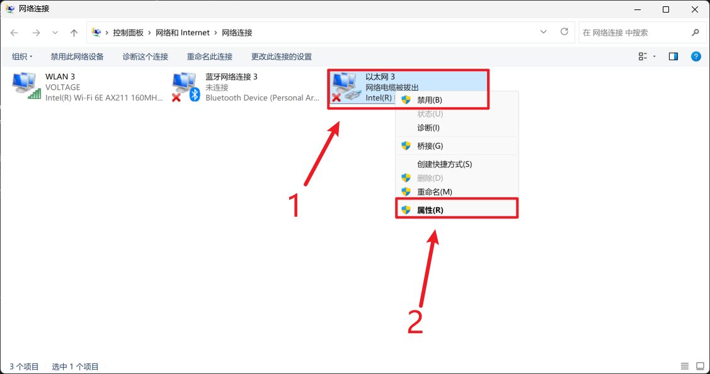
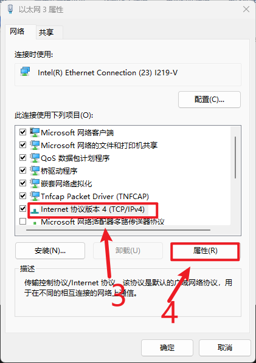
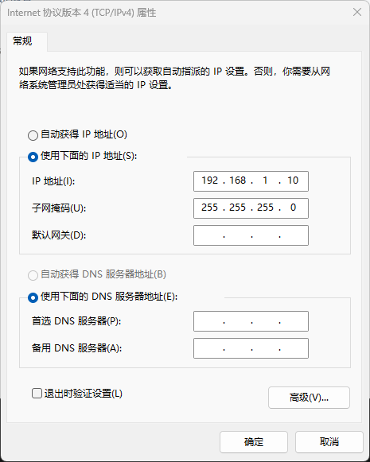

# Deployment Prerequisites

Before deploying the EMS system, the gateway device must first be connected to the network. Depending on the on-site environment, one of the following two methods can be used to establish a connection with the gateway.

**Required tools**: Ethernet cable, gateway device, computer (or laptop)

## Network Connection Methods

Regardless of the method used, the Ethernet cable must be connected to the **LAN2** port of the gateway. The LAN2 port is located at the **bottom-left corner** of the four Ethernet ports on the front panel of the gateway, as shown below:

The default IP address of LAN2 is **192.168.1.233**.

---

### Method 1: Connection via the Same Local Area Network (LAN)

This method applies when both the computer and the gateway are connected to the same router or switch (e.g., on-site deployment or office debugging).

1. Connect one end of the Ethernet cable to the **LAN2** port of the gateway, and the other end to a router/switch or the computer’s Ethernet port.
2. Ensure that the computer and the gateway are in the same local network (same subnet).
3. Open the EMS Edge Configuration application on the computer and connect to the gateway using its IP address (refer to the [Login Page](/cn/manuals/system-config/login.html) for details).

---

### Method 2: Direct Connection Between Laptop and Gateway

This method is suitable when no router is available on site and a direct connection is required for debugging.

1. Connect one end of the Ethernet cable to the **LAN2** port of the gateway, and the other end to the laptop’s Ethernet port.
2. Configure a static IP address on the laptop within the same subnet as the gateway (e.g., 192.168.1.100), with a subnet mask of 255.255.255.0.
3. Open the EMS Edge Configuration application and connect to the gateway using its IP address (192.168.1.233).

---

> **Notes:**
>
> 1. **Static IP is required**: In direct connection mode, the laptop must be manually configured with a static IP in the same subnet as the gateway. **Do not use DHCP (automatic IP assignment)**. Since there is no DHCP server in direct mode, automatic configuration will fail and prevent communication with the gateway.
>
> 
>
> 2. Open **Control Panel** → **Network and Sharing Center** → **Change adapter settings**, then right-click **Ethernet**.
> 3. Click **Properties**.
>
> 
>
> 4. Select **Internet Protocol Version 4 (TCP/IPv4)**.
> 5. Click **Properties**.
>
> 
>
> 6. Configure the settings as shown (IP address can be adjusted as needed), then click **OK**.
>
> 2. **IP Address Conflict**: If the laptop is connected to another network via WiFi, ensure that the configured static IP (e.g., 192.168.1.100) does not conflict with the existing network. If necessary, temporarily disable WiFi and use only the wired connection for debugging.
>
> 3. **Pre-connection Check**: Ensure that both ends of the Ethernet cable are securely connected and that the port indicator lights are functioning properly before attempting to connect.