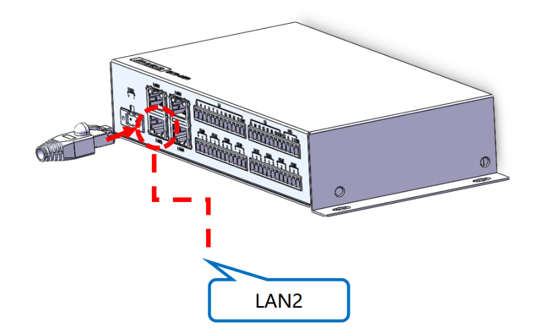

# Deployment Prerequisites

Before deploying the EMS system, you need to connect the gateway machine to the network first.

Required tools: network cable, gateway machine, computer

Steps:

1. Connect the network cable to the LAN2 port of the gateway machine, as shown in the figure.

   

2. Under the same LAN, use the EMS Edge Configuration application on your computer to connect to the gateway machine (for details, see the [login page](/manuals/system-config/login.html) introduction).
