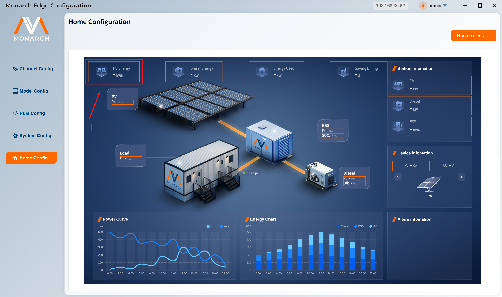
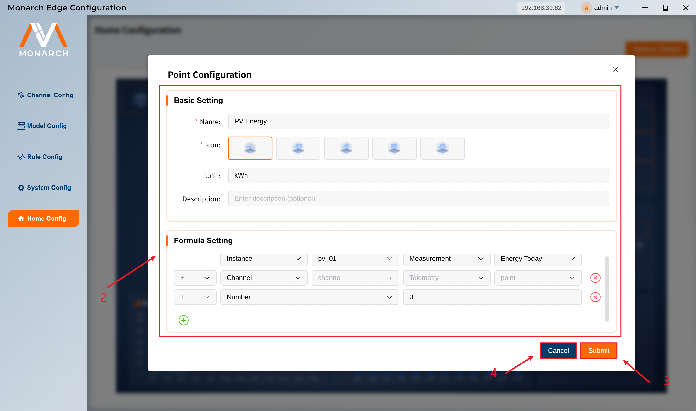
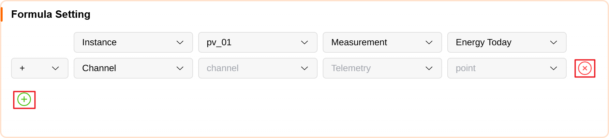

# Home Point Setup

In the configuration area below, the home dashboard preview is displayed with proportional scaling. Click the **orange highlighted area** to configure points:

1. **Overview (top-left)**: **4** configurable points. Usually used for summary data such as PV total generation, diesel total generation, and total load consumption.
2. **Topology (middle-left)**: **6** configurable points. Includes `PV`, `Load`, `Diesel`, and `ESS`. Each device has 1-2 configurable points, usually used for running data such as power, voltage, current, and SOC.
3. **Station Information (top-right)**: **3** configurable points. Usually used for key station indicators such as PV power and diesel power.
4. **Device Information (middle-right)**: **6** configurable points. Displayed in a carousel for PV, Diesel, and ESS. Users can switch devices and configure 2 points for each.

1. Click a target point in the orange highlighted area to open the point setup dialog.

2. The setup dialog has two sections: **Basic Setting** and **Formula Setting**.

- **Basic Setting** includes:
  - `Name`: display name
  - `Icon`: icon selector (available for Overview and Station Information points)
  - `Unit`: display unit
  - `Description`: description text (not shown on the home page)

- **Formula Setting** supports three source types:
  - `Channel`: select channel, point type, and point
  - `Instance`: select instance, point type, and point
  - `Number`: input a constant number

  You can add multiple source rows and combine them with operators `+`, `-`, `×`, `÷`.

  

3. Click **Submit** to save changes.
4. Click **Cancel** to discard changes.
