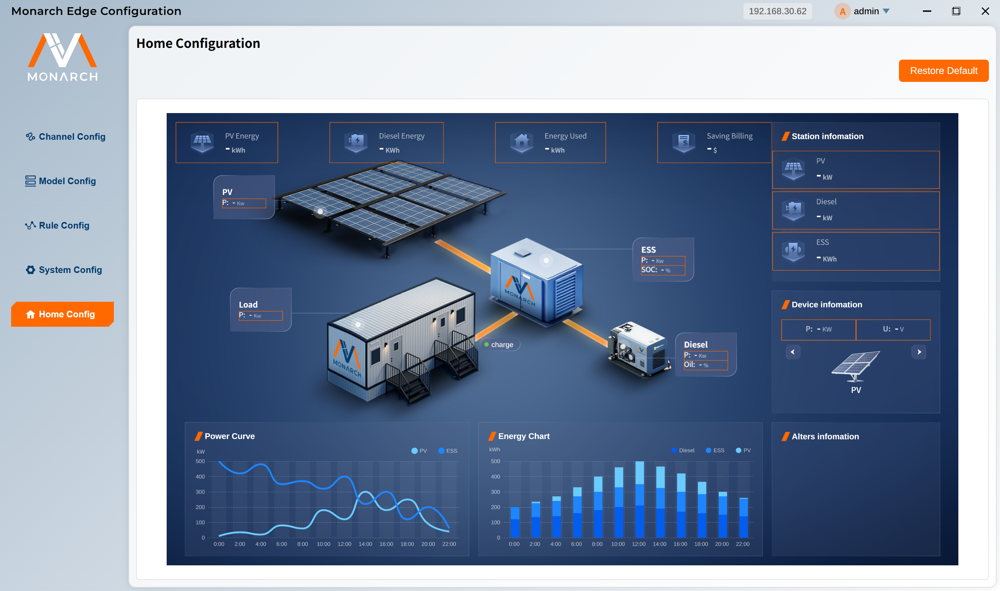

# Home Configuration

Home configuration customizes what appears on the Edge front-end home dashboard and how each card value is calculated. You can bind channel points, instance points, or formulas to fixed card positions for real-time display.

**Main capabilities:**

- Configure the data points shown on the home page
- Customize display name, unit, and icon
- Combine Channel points, Instance points, and constants with formulas
- Persist configuration and apply it automatically after page load
