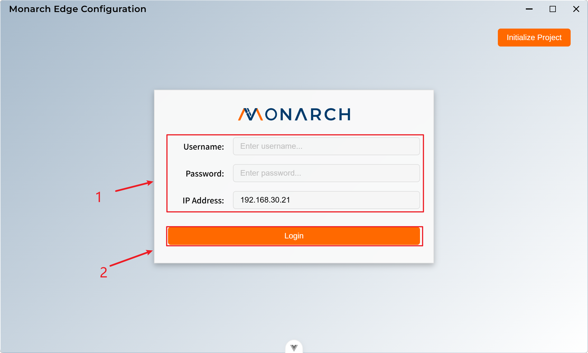

# Login

The login interface is the first step to access the system. The system provides a clean and beautiful login interface with username, password input fields, IP address input field, and login button.

1. Fill in the user's basic information:
   * `Username`: User name
   * `Password`: User password
   * `Ip Address`: The IP address of the gateway machine to connect to. All subsequent data interactions will be performed with this gateway machine.

2. Click the **Login** button to log in.
